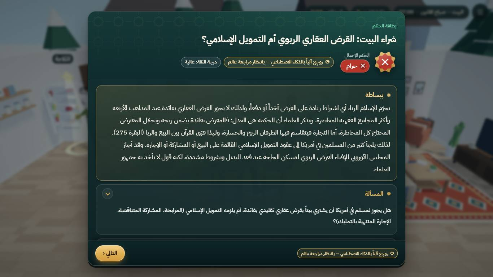
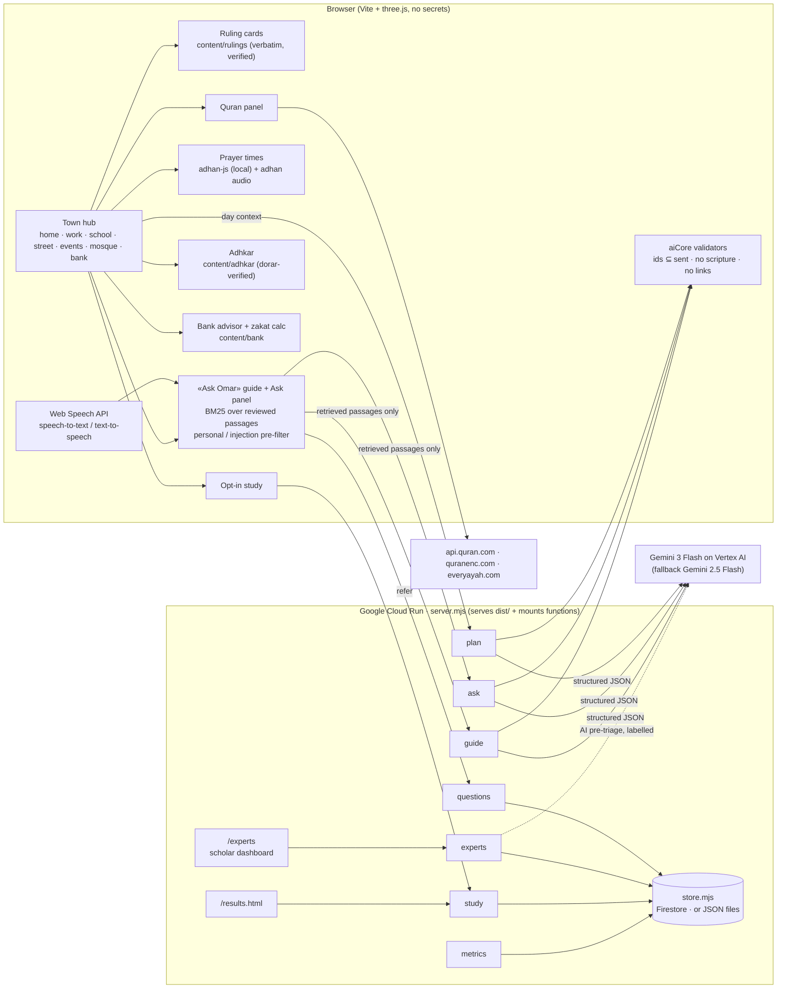

<div dir="rtl">

# «يومك» — Yawmuk

**عالم ثلاثي الأبعاد في المتصفح: حيّ واحد متصل («حيّ السلام») يعيش فيه الزائر يوماً كاملاً، من البيت إلى العمل والكلية والشارع والمسجد والبنك، ويرى كيف يتعامل المسلم مع مواقف الحياة اليومية، ويقرأ أحكامها بأدلتها، ويحاور مرشداً بالصوت أو بالكتابة يجيب من مصادر موثّقة.**

</div>

**Yawmuk («يومك», "your day")** is a browser 3D world: one day in a Muslim neighbourhood, where **Adam**, a newcomer curious about Islam, meets everyday situations and sees how his Muslim neighbours, coworkers and friends handle them. It runs on desktop and phone, in Arabic (RTL) and English, with no install and no account.

| | |
|---|---|
| 🎮 **المنصة · Live demo** | https://yawmuk.world |
| 🏠 **صفحة التعريف · Landing** | https://yawmuk.world/landing |
| 🎬 **الفيديو · Video** | [▶️ media/yawmuk-promo.mp4](https://github.com/yawmuk/yawmuk/blob/main/media/yawmuk-promo.mp4) |

---

## Features · المزايا

- **One walkable town** with doors to home, work, college, street, event hall, neighbours, **mosque** and **bank**.
- **7 everyday situations**, each ending in a **ruling card**: the verdict in plain words, verbatim Quran and hadith (with number, grade and link), the four madhhabs side by side, and when to ask a scholar.
- **Mosque:** live prayer times with the adhan, recited Quran with translation of meanings, morning and evening adhkar with counters.
- **Bank:** Islamic-finance contract cards, a zakat calculator and a loan / murabaha / musharaka comparison.
- **«Ask Omar» guide** by voice or text, answering only from reviewed passages and referring personal questions to a scholar; voice in **five languages** (Arabic, English, Spanish, Chinese, Hindi).
- **Scholar dashboard** (`/experts`): players send questions the guide cannot answer; scholars answer them with sources.
- **Opt-in micro-study** with live aggregates at `/results.html`.

| Location · الموقع | Situations · المواقف |
|---|---|
| 🏠 Home · البيت | Purity and the mosque: wudu and shoes · الطهارة والمسجد: الوضوء وخلع الحذاء |
| 💼 Work · العمل | Belief: declining a lucky charm, trusting God · العقيدة: رفض تميمة الحظ والتوكل على الله<br>Hijab: respect and dignity at work · الحجاب: الاحترام والتكريم في العمل |
| 🎓 College · الكلية | Pork: abstaining in obedience to God · أكل الخنزير: الامتناع طاعةً لله |
| 🌃 Street · الشارع | Gambling and the lottery: protecting society · القمار واليانصيب: حفظ المجتمع |
| 🎉 Event hall · قاعة المناسبات | Alcohol: the party toast and protecting the mind · شرب الخمر: نخب الحفل وحفظ العقل |
| 💍 Neighbours · بيت الجيران | Marriage: the proposal, the guardian and the mahr · إجراءات الزواج: الخطبة والولي والمهر |
| 🕌 Mosque · المسجد | Prayer times & adhan · Recited Quran with translation of meanings · Morning/evening adhkar · Ask a scholar |
| 🏦 Bank · البنك | Contract cards · Zakat on savings · House-finance comparison |

**Controls:** WASD/arrows to move, Shift to run, drag to orbit, **E** to interact, Esc for the menu. On a phone: joystick, drag to look, and the **Interact** button.

## Screenshots · لقطات

| Start (AR) | Dialogue & choices (EN) | Ruling card (AR) |
|---|---|---|
|  |  |  |
| **Quran evidence (EN)** | **Four madhhabs (AR)** | **Phone (390×844, AR)** |
|  |  |  |


## Technologies used · التقنيات المستخدمة

| Layer | Used |
|---|---|
| 3D & front end | [three.js](https://threejs.org/) (WebGPU renderer with WebGL2 fallback), Vite 6, plain JavaScript modules, HTML/CSS (RTL) |
| Server | Node.js 22, `server.mjs` (serves `dist/` and mounts every function in `netlify/functions/`), Docker, Google Cloud Run |
| AI | **Gemini 3 Flash** on **Google Cloud Vertex AI** (fallback Gemini 2.5 Flash), structured JSON output checked by validators; Anthropic Claude supported as an alternative |
| Voice | Web Speech API (speech-to-text in the browser), Gemini text-to-speech on Vertex AI |
| Storage | Google Cloud Firestore (or local JSON files) |
| Prayer times | [adhan-js](https://github.com/batoulapps/adhan-js), computed on the device |
| Quran | api.quran.com (KFGQPC Hafs text), quranenc.com (translations), everyayah.com (recitation) |
| Hadith & adhkar | Hisn al-Muslim, hadith-api (sunnah.com text), dorar.net for grading |
| 3D assets | Kenney, Poly Haven, poly.pizza (CC0), Quaternius characters (CC0), 11 CC-BY 3.0 models |
| Fonts | Amiri, Amiri Quran, IBM Plex Sans Arabic, Reem Kufi (SIL OFL 1.1) |
| Tests | `node:test` (unit, content, safety, AI-validator, eval suites), puppeteer-core (headless playthrough) |

## Architecture · البنية




## Setup, keys & run · التشغيل والمفاتيح


### 1. Prerequisites · المتطلبات

- **Node.js 22+** and npm.
- Chrome or Edge (WebGL2; WebGPU is used when available).
- Optional, for AI: the **Google Cloud CLI** (`gcloud`) and a Google Cloud project with billing and the **Vertex AI API** enabled.

### 2. Run without keys (2 minutes) · التشغيل بدون مفاتيح

```bash
git clone https://github.com/yawmuk/yawmuk.git && cd yawmuk
npm ci                 # exact locked dependencies
npm test               # automated tests: content contracts, safety, AI validators, features, eval (no browser, no keys)
npm run dev            # game only: http://localhost:5173/?scene=town&nointro=1  (Vite does not serve the AI functions)
```

Full stack (game + AI functions + `/experts` + `/results.html`), exactly as on Cloud Run:

```bash
npm run build          # -> dist/ (game + scholar dashboard)
npm start              # node server.mjs on http://localhost:8080
```

### 3. Keys & variables · المفاتيح والمتغيرات

Copy [`.env.example`](.env.example) to `.env`, fill what you need, then run `node --env-file=.env server.mjs`. **Never commit `.env`** (it is git-ignored).

| Variable | Needed for | How to get it |
|---|---|---|
| `GOOGLE_CLOUD_PROJECT` | AI (Gemini on Vertex AI), voice, Firestore | Your project id: `gcloud config get-value project` |
| `GOOGLE_ACCESS_TOKEN` | AI + voice **when running locally** | `gcloud auth login` then `gcloud auth print-access-token` (valid ~1 hour). **Not needed on Cloud Run**: the service account is used. |
| `EXPERTS_PASSCODE` | Scholar dashboard `/experts` | Any strong passcode you choose; share it out of band. |
| `SESSION_SECRET` | Scholar dashboard session cookie | `openssl rand -hex 32` |
| `STORE=firestore`, `FIRESTORE_DATABASE` | Durable storage on Cloud Run | Create a Firestore (Native) database; without it, data is kept in `./data` (lost on Cloud Run restarts). |
| `STUDY_ADMIN_KEY` | Optional: free-text comments in the study CSV export | Any random string. |
| `GEMINI_API_KEY` | Optional alternative to Vertex (e.g. on Netlify) | [Google AI Studio](https://aistudio.google.com/apikey). ⚠️ When set it **takes priority over Vertex**; a key without credit breaks the AI features. |
| `ANTHROPIC_API_KEY` | Optional alternative: Claude instead of Gemini | [Anthropic Console](https://console.anthropic.com/). When set, Claude takes priority unless `LLM_PROVIDER=vertex`. |

Optional tuning: `VERTEX_LOCATION` (default `global`), `YAWMUK_GEMINI_MODEL` (default `gemini-3-flash-preview`), `YAWMUK_GEMINI_FALLBACK` (default `gemini-2.5-flash`), `YAWMUK_TTS_MODEL`, `YAWMUK_TTS_VOICE`, `LLM_PROVIDER` (`vertex` | `claude`), `DATA_DIR`, `PORT`.

The Google account or service account that calls Vertex AI needs the role **`roles/aiplatform.user`**, and Firestore needs **`roles/datastore.user`**.

### 4. Run locally with AI (Gemini on Vertex AI) · التشغيل مع الذكاء الاصطناعي

```bash
gcloud auth login
gcloud services enable aiplatform.googleapis.com --project <YOUR_PROJECT_ID>
npm run build
GOOGLE_CLOUD_PROJECT=<YOUR_PROJECT_ID> \
GOOGLE_ACCESS_TOKEN="$(gcloud auth print-access-token)" \
EXPERTS_PASSCODE=dev-passcode SESSION_SECRET="$(openssl rand -hex 32)" \
node server.mjs
# game:      http://localhost:8080/?scene=town&nointro=1
# dashboard: http://localhost:8080/experts      (passcode: dev-passcode)
# results:   http://localhost:8080/results.html
```

Quick AI check: `curl -s -X POST localhost:8080/.netlify/functions/plan -H 'content-type: application/json' -d '{"lang":"en","topics":["money"]}'` returns a journey (or an `error`, in which case the game falls back on its own).

### 5. Deploy to Google Cloud Run · النشر على Google Cloud Run

```bash
PROJECT=<YOUR_PROJECT_ID>; REGION=us-central1; SERVICE=yawmuk
gcloud config set project $PROJECT

# 1) APIs
gcloud services enable run.googleapis.com cloudbuild.googleapis.com artifactregistry.googleapis.com \
  secretmanager.googleapis.com firestore.googleapis.com aiplatform.googleapis.com

# 2) Runtime service account + roles (Gemini on Vertex AI, Firestore)
SA="$(gcloud projects describe $PROJECT --format='value(projectNumber)')-compute@developer.gserviceaccount.com"
gcloud projects add-iam-policy-binding $PROJECT --member="serviceAccount:$SA" --role=roles/aiplatform.user
gcloud projects add-iam-policy-binding $PROJECT --member="serviceAccount:$SA" --role=roles/datastore.user

# 3) Firestore (Native) for the scholar queue, reviews and study records
gcloud firestore databases create --database='(default)' --location=nam5 --type=firestore-native

# 4) Secrets (generated here, never written to the repo)
printf '%s' "$(openssl rand -base64 18)" | gcloud secrets create EXPERTS_PASSCODE --data-file=-
openssl rand -hex 32 | tr -d '\n' | gcloud secrets create SESSION_SECRET --data-file=-
for S in EXPERTS_PASSCODE SESSION_SECRET; do
  gcloud secrets add-iam-policy-binding $S --member="serviceAccount:$SA" --role=roles/secretmanager.secretAccessor
done

# 5) Build from source (Dockerfile) and deploy
gcloud run deploy $SERVICE --source . --region $REGION --allow-unauthenticated \
  --port 8080 --cpu 1 --memory 512Mi --min-instances 1 --max-instances 4 --timeout 60 \
  --set-env-vars STORE=firestore,GOOGLE_CLOUD_PROJECT=$PROJECT \
  --set-secrets EXPERTS_PASSCODE=EXPERTS_PASSCODE:latest,SESSION_SECRET=SESSION_SECRET:latest
#    If the build fails with a storage permission error, add --build-service-account <a SA with storage + logging access>.

# 6) Smoke test, and the passcode to hand to scholars (out of band)
URL=$(gcloud run services describe $SERVICE --region $REGION --format='value(status.url)')
curl -sI "$URL/" | head -1                                                      # HTTP/2 200
curl -s -X POST "$URL/.netlify/functions/plan" -H 'content-type: application/json' -d '{"lang":"en","topics":["money"]}' | head -c 300
gcloud secrets versions access latest --secret=EXPERTS_PASSCODE; echo
```

- **Do not set `GEMINI_API_KEY` on Cloud Run** unless that key has AI Studio credit: it takes priority over the service account.
- To use Claude instead: create an `ANTHROPIC_API_KEY` secret the same way and add it to `--set-secrets`.
- Without Firestore: drop `STORE=firestore` and use `--max-instances 1`; data then resets on every new revision.
- Rollback: `gcloud run services update-traffic $SERVICE --region $REGION --to-revisions <PREVIOUS_REVISION>=100`.
- **Netlify alternative** (game + AI only, no durable scholar queue): `netlify.toml` is ready; set `GEMINI_API_KEY` or `ANTHROPIC_API_KEY` in the site's environment variables.

### 6. Other scripts · أوامر أخرى

```bash
npm run audit          # re-verify every Quran/hadith text against its source + check every link (network)
npm run test:e2e       # headless Chrome playthrough (needs Chrome; set CHROME_PATH if it is not found)
```

No secrets are committed to this repository. Keys live only in `.env` (local, git-ignored), Secret Manager (Cloud Run) or the host's environment.

### Repository layout · بنية المستودع

| Path | What |
|---|---|
| `src/` | The game: 3D engine (three.js, WebGPU/WebGL2), scenes, features (prayer, Quran, adhkar, bank, guide, voice, study), UI |
| `content/` | Reviewed content: rulings, script, Quran, adhkar, bank cards, library, `sources.json` |
| `netlify/functions/`, `netlify/lib/` | Server functions (AI guide, planner, NPC, TTS, scholar queue, study) and the Vertex/Claude/Firestore adapters |
| `server.mjs`, `Dockerfile` | Production server for Cloud Run (serves `dist/` + mounts every function) |
| `public/` | 3D assets (CC0/CC-BY, see `public/assets/LICENSES.md`), audio, brand, landing page |
| `tests/` | `node:test` suites + headless e2e |
| `tools/` | Citation audit, eval, asset and character pipelines |

## Licences · التراخيص

**Code:** [MIT](LICENSE). **Content** (`content/`): CC BY-NC-SA 4.0; Quran and hadith texts remain under their publishers' terms. **3D assets:** see [`public/assets/LICENSES.md`](public/assets/LICENSES.md); CC-BY models are credited in the in-game **Credits** screen. **Adhan audio:** «The Adhan – Muslim Call to Prayer – Aaqib Azeez» by Atcovi, [Wikimedia Commons](https://commons.wikimedia.org/wiki/File:The_Adhan_-_Muslim_Call_to_Prayer_-_Aaqib_Azeez.mp3), CC BY-SA 4.0.

## Submission and review status

- **Deck:** [Final presentation](https://github.com/yawmuk/yawmuk/blob/main/docs/deck/Yawmuk_Final_Deck.pdf).
- **Team:** Abubakr Abusham and Mohamed Al-Mubarak, assisted by AI coding agents.
- The educational explanations are not a fatwa. Content remains pending scholarly review; source verification does not replace review by a qualified scholar.
- Judge shortcuts: [Town](https://yawmuk.world/?scene=town&nointro=1), [Mosque](https://yawmuk.world/?scene=mosque), [Bank](https://yawmuk.world/?scene=bank), [Study](https://yawmuk.world/?study=1), [Experts](https://yawmuk.world/experts), [Results](https://yawmuk.world/results.html).

المحتوى التعليمي بانتظار مراجعة علمية بشرية، ولا يمثل فتوى شخصية.
