# Yawmuk 3D asset library

Generated by `node tools/assets/measure.mjs` from `tools/assets/assets.spec.mjs`. Do not edit by hand. Re-run `node tools/assets/fetch.mjs && node tools/assets/thumbs.mjs && node tools/assets/measure.mjs` to rebuild (gltf-transform/sharp/meshoptimizer are installed on demand into the OS temp folder, never into package.json). `node tools/assets/measure.mjs --check` only verifies. Find more models with `node tools/assets/polysearch.mjs "query" --cc0`.

**253 assets** (235 props, 6 HDRIs, 12 PBR textures), **16.4 MB** on disk. Machine-readable catalogue: [`public/assets/catalog.json`](../public/assets/catalog.json). Runtime URL: `import.meta.env.BASE_URL + file` — Vite uses `base: './'`, so catalogue `file` values (`assets/props/…`) are relative; they are served from `public/`.

**Licences (unique assets):** 242 × CC0 1.0, 11 × CC-BY 3.0. An asset can be suggested for several locations, so it can appear in more than one table below (the 11 CC-BY models fill 19 table rows). The authoritative list is [`public/assets/LICENSES.md`](../public/assets/LICENSES.md); the in-game Credits screen is built from it. The animated characters are licensed separately in [`public/assets/characters/LICENSES.md`](../public/assets/characters/LICENSES.md) (Quaternius, CC0 1.0).

## How to use

- All props are pre-scaled to real-world metres and pre-pivoted to bottom-centre: add to the scene at scale 1, y = 0.
- GLBs use EXT_meshopt_compression + KHR_mesh_quantization (and EXT_texture_webp where textured): call loader.setMeshoptDecoder(MeshoptDecoder) from three/examples/jsm/libs/meshopt_decoder.module.js.
- Facing direction is whatever the source model used (Kenney furniture/vehicles mostly face +Z); rotate per scene as needed.
- HDRIs: load with RGBELoader and PMREMGenerator. Textures: diff = sRGB colour, nor = OpenGL normal map, rough = roughness (linear). real_size_m tells how many metres one texture tile covers.

```js
import { GLTFLoader } from 'three/examples/jsm/loaders/GLTFLoader.js';
import { MeshoptDecoder } from 'three/examples/jsm/libs/meshopt_decoder.module.js';
const loader = new GLTFLoader().setMeshoptDecoder(MeshoptDecoder);
const { scene: sofa } = await loader.loadAsync('assets/props/kenney-furniture/sofa.glb');
sofa.position.set(x, 0, z); // already metres, bottom-centre pivot
```

Dimensions below are **width (x) × height (y) × depth (z) in metres**, measured with three.js after loading at scale 1.

## home — suburban house interior (snowy morning)

| | id | kind | dims (m) | file | licence |
|---|---|---|---|---|---|
| 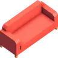 | `sofa` | prop | 2.16 × 1.01 × 0.9 | `props/kenney-furniture/sofa.glb` | CC0 1.0 |
| 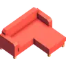 | `sofa_long` | prop | 2.16 × 1.01 × 1.8 | `props/kenney-furniture/sofa_long.glb` | CC0 1.0 |
|  | `sofa_corner` | prop | 2.16 × 1.01 × 2.16 | `props/kenney-furniture/sofa_corner.glb` | CC0 1.0 |
|  | `armchair` | prop | 1.08 × 1.01 × 0.9 | `props/kenney-furniture/armchair.glb` | CC0 1.0 |
|  | `armchair_relax` | prop | 1.08 × 1.39 × 1.48 | `props/kenney-furniture/armchair_relax.glb` | CC0 1.0 |
|  | `ottoman` | prop | 0.97 × 0.51 × 0.99 | `props/kenney-furniture/ottoman.glb` | CC0 1.0 |
| 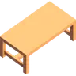 | `dining_table` | prop | 1.85 × 0.72 × 0.98 | `props/kenney-furniture/dining_table.glb` | CC0 1.0 |
|  | `table_round` | prop | 1.52 × 0.81 × 1.76 | `props/kenney-furniture/table_round.glb` | CC0 1.0 |
| 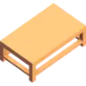 | `coffee_table` | prop | 1.45 × 0.51 × 0.88 | `props/kenney-furniture/coffee_table.glb` | CC0 1.0 |
| 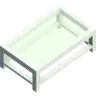 | `coffee_table_glass` | prop | 1.45 × 0.51 × 0.88 | `props/kenney-furniture/coffee_table_glass.glb` | CC0 1.0 |
|  | `side_table` | prop | 1.18 × 0.85 × 0.48 | `props/kenney-furniture/side_table.glb` | CC0 1.0 |
|  | `side_table_drawers` | prop | 1.18 × 0.85 × 0.49 | `props/kenney-furniture/side_table_drawers.glb` | CC0 1.0 |
|  | `chair` | prop | 0.44 × 1.03 × 0.44 | `props/kenney-furniture/chair.glb` | CC0 1.0 |
|  | `chair_cushion` | prop | 0.44 × 1.01 × 0.44 | `props/kenney-furniture/chair_cushion.glb` | CC0 1.0 |
|  | `chair_desk` | prop | 0.74 × 1.34 × 0.69 | `props/kenney-furniture/chair_desk.glb` | CC0 1.0 |
|  | `stool_bar` | prop | 0.58 × 0.96 × 0.51 | `props/kenney-furniture/stool_bar.glb` | CC0 1.0 |
|  | `bench_cushion` | prop | 0.88 × 1.01 × 0.44 | `props/kenney-furniture/bench_cushion.glb` | CC0 1.0 |
| 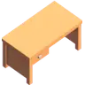 | `desk` | prop | 1.62 × 0.85 × 0.86 | `props/kenney-furniture/desk.glb` | CC0 1.0 |
| 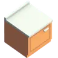 | `kitchen_cabinet` | prop | 0.95 × 0.99 × 0.99 | `props/kenney-furniture/kitchen_cabinet.glb` | CC0 1.0 |
| 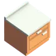 | `kitchen_cabinet_drawer` | prop | 0.95 × 0.99 × 0.99 | `props/kenney-furniture/kitchen_cabinet_drawer.glb` | CC0 1.0 |
| 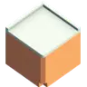 | `kitchen_cabinet_corner` | prop | 1.01 × 0.99 × 1.01 | `props/kenney-furniture/kitchen_cabinet_corner.glb` | CC0 1.0 |
|  | `kitchen_cabinet_upper` | prop | 0.95 × 0.86 × 0.48 | `props/kenney-furniture/kitchen_cabinet_upper.glb` | CC0 1.0 |
|  | `kitchen_cabinet_upper_double` | prop | 0.95 × 0.86 × 0.48 | `props/kenney-furniture/kitchen_cabinet_upper_double.glb` | CC0 1.0 |
|  | `kitchen_bar` | prop | 0.95 × 0.92 × 0.46 | `props/kenney-furniture/kitchen_bar.glb` | CC0 1.0 |
|  | `kitchen_bar_end` | prop | 0.22 × 0.92 × 0.46 | `props/kenney-furniture/kitchen_bar_end.glb` | CC0 1.0 |
| 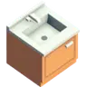 | `kitchen_sink` | prop | 0.95 × 1.08 × 0.99 | `props/kenney-furniture/kitchen_sink.glb` | CC0 1.0 |
| 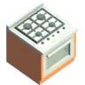 | `stove` | prop | 0.95 × 0.99 × 0.99 | `props/kenney-furniture/stove.glb` | CC0 1.0 |
| 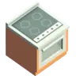 | `stove_electric` | prop | 0.95 × 0.99 × 0.99 | `props/kenney-furniture/stove_electric.glb` | CC0 1.0 |
|  | `range_hood` | prop | 0.95 × 0.88 × 0.63 | `props/kenney-furniture/range_hood.glb` | CC0 1.0 |
| 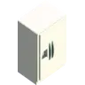 | `fridge` | prop | 1.14 × 2.02 × 0.89 | `props/kenney-furniture/fridge.glb` | CC0 1.0 |
| 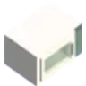 | `microwave` | prop | 0.64 × 0.4 × 0.51 | `props/kenney-furniture/microwave.glb` | CC0 1.0 |
|  | `coffee_machine` | prop | 0.42 × 0.39 × 0.53 | `props/kenney-furniture/coffee_machine.glb` | CC0 1.0 |
|  | `blender` | prop | 0.3 × 0.5 × 0.24 | `props/kenney-furniture/blender.glb` | CC0 1.0 |
|  | `toaster` | prop | 0.41 × 0.29 × 0.22 | `props/kenney-furniture/toaster.glb` | CC0 1.0 |
|  | `bookcase` | prop | 0.88 × 1.94 × 0.55 | `props/kenney-furniture/bookcase.glb` | CC0 1.0 |
|  | `bookcase_low` | prop | 0.88 × 0.88 × 0.55 | `props/kenney-furniture/bookcase_low.glb` | CC0 1.0 |
|  | `bookcase_doors` | prop | 0.88 × 1.87 × 0.55 | `props/kenney-furniture/bookcase_doors.glb` | CC0 1.0 |
|  | `books` | prop | 0.33 × 0.23 × 0.21 | `props/kenney-furniture/books.glb` | CC0 1.0 |
|  | `bed_double` | prop | 2.1 × 0.82 × 2.48 | `props/kenney-furniture/bed_double.glb` | CC0 1.0 |
|  | `tv` | prop | 1.51 × 1 × 0.28 | `props/kenney-furniture/tv.glb` | CC0 1.0 |
|  | `tv_cabinet` | prop | 1.76 × 0.68 × 0.55 | `props/kenney-furniture/tv_cabinet.glb` | CC0 1.0 |
|  | `lamp_floor_round` | prop | 0.33 × 1.89 × 0.39 | `props/kenney-furniture/lamp_floor_round.glb` | CC0 1.0 |
|  | `lamp_floor_square` | prop | 0.26 × 1.89 × 0.26 | `props/kenney-furniture/lamp_floor_square.glb` | CC0 1.0 |
|  | `lamp_table_round` | prop | 0.33 × 0.69 × 0.39 | `props/kenney-furniture/lamp_table_round.glb` | CC0 1.0 |
|  | `lamp_table_square` | prop | 0.26 × 0.64 × 0.26 | `props/kenney-furniture/lamp_table_square.glb` | CC0 1.0 |
|  | `lamp_ceiling` | prop | 0.26 × 0.51 × 0.26 | `props/kenney-furniture/lamp_ceiling.glb` | CC0 1.0 |
|  | `lamp_wall` | prop | 0.5 × 0.2 × 0.33 | `props/kenney-furniture/lamp_wall.glb` | CC0 1.0 |
|  | `ceiling_fan` | prop | 1 × 0.29 × 1.16 | `props/kenney-furniture/ceiling_fan.glb` | CC0 1.0 |
|  | `plant_potted` | prop | 0.47 × 1.44 × 0.53 | `props/kenney-furniture/plant_potted.glb` | CC0 1.0 |
|  | `plant_small_1` | prop | 0.21 × 0.31 × 0.21 | `props/kenney-furniture/plant_small_1.glb` | CC0 1.0 |
|  | `plant_small_2` | prop | 0.21 × 0.31 × 0.21 | `props/kenney-furniture/plant_small_2.glb` | CC0 1.0 |
|  | `plant_small_3` | prop | 0.22 × 0.32 × 0.19 | `props/kenney-furniture/plant_small_3.glb` | CC0 1.0 |
| 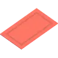 | `rug_rect` | prop | 3.45 × 0.02 × 2.02 | `props/kenney-furniture/rug_rect.glb` | CC0 1.0 |
|  | `rug_round` | prop | 2.02 × 0.02 × 2.02 | `props/kenney-furniture/rug_round.glb` | CC0 1.0 |
|  | `rug_rounded` | prop | 3.45 × 0.02 × 2.02 | `props/kenney-furniture/rug_rounded.glb` | CC0 1.0 |
|  | `doormat` | prop | 0.94 × 0.02 × 0.52 | `props/kenney-furniture/doormat.glb` | CC0 1.0 |
|  | `laptop` | prop | 0.58 × 0.36 × 0.53 | `props/kenney-furniture/laptop.glb` | CC0 1.0 |
|  | `radio` | prop | 0.69 × 0.5 × 0.21 | `props/kenney-furniture/radio.glb` | CC0 1.0 |
| 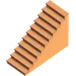 | `stairs` | prop | 4.01 × 2.95 × 1.74 | `props/kenney-furniture/stairs.glb` | CC0 1.0 |
| 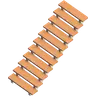 | `stairs_open` | prop | 4.01 × 2.95 × 1.74 | `props/kenney-furniture/stairs_open.glb` | CC0 1.0 |
|  | `doorway` | prop | 1.07 × 2.22 × 0.25 | `props/kenney-furniture/doorway.glb` | CC0 1.0 |
| 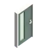 | `doorway_front` | prop | 1.07 × 2.22 × 0.25 | `props/kenney-furniture/doorway_front.glb` | CC0 1.0 |
| 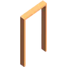 | `doorway_open` | prop | 1.07 × 2.22 × 0.2 | `props/kenney-furniture/doorway_open.glb` | CC0 1.0 |
|  | `wall_window` | prop | 2.2 × 2.84 × 0.2 | `props/kenney-furniture/wall_window.glb` | CC0 1.0 |
|  | `wall_window_slide` | prop | 2.2 × 2.84 × 0.2 | `props/kenney-furniture/wall_window_slide.glb` | CC0 1.0 |
|  | `wall` | prop | 2.2 × 2.84 × 0.11 | `props/kenney-furniture/wall.glb` | CC0 1.0 |
|  | `wall_doorway` | prop | 2.2 × 2.84 × 0.2 | `props/kenney-furniture/wall_doorway.glb` | CC0 1.0 |
|  | `coat_rack_standing` | prop | 0.6 × 1.69 × 0.6 | `props/kenney-furniture/coat_rack_standing.glb` | CC0 1.0 |
|  | `coat_rack_wall` | prop | 0.99 × 0.62 × 0.3 | `props/kenney-furniture/coat_rack_wall.glb` | CC0 1.0 |
|  | `shoe_rack` | prop | 0.88 × 0.88 × 0.55 | `props/kenney-furniture/shoe_rack.glb` | CC0 1.0 |
|  | `cardboard_box` | prop | 0.47 × 0.62 × 0.47 | `props/kenney-furniture/cardboard_box.glb` | CC0 1.0 |
|  | `cardboard_box_open` | prop | 0.82 × 0.62 × 0.47 | `props/kenney-furniture/cardboard_box_open.glb` | CC0 1.0 |
|  | `trashcan_small` | prop | 0.46 × 0.94 × 0.52 | `props/kenney-furniture/trashcan_small.glb` | CC0 1.0 |
|  | `pillow` | prop | 0.51 × 0.49 × 0.19 | `props/kenney-furniture/pillow.glb` | CC0 1.0 |
|  | `mug` | prop | 0.13 × 0.1 × 0.1 | `props/kenney-food/mug.glb` | CC0 1.0 |
|  | `plate` | prop | 0.27 × 0.07 × 0.27 | `props/kenney-food/plate.glb` | CC0 1.0 |
|  | `wine_bottle_red` | prop | 0.08 × 0.3 × 0.07 | `props/kenney-food/wine_bottle_red.glb` | CC0 1.0 |
|  | `bread` | prop | 0.3 × 0.23 × 0.19 | `props/kenney-food/bread.glb` | CC0 1.0 |
|  | `meat_raw` | prop | 0.21 × 0.03 × 0.25 | `props/kenney-food/meat_raw.glb` | CC0 1.0 |
|  | `candy_bar` | prop | 0.14 × 0.03 × 0.04 | `props/kenney-food/candy_bar.glb` | CC0 1.0 |
|  | `frying_pan` | prop | 0.29 × 0.05 × 0.45 | `props/kenney-food/frying_pan.glb` | CC0 1.0 |
|  | `pot` | prop | 0.3 × 0.05 × 0.29 | `props/kenney-food/pot.glb` | CC0 1.0 |
|  | `christmas_tree` | prop | 1.82 × 3.5 × 1.82 | `props/kenney-holiday/christmas_tree.glb` | CC0 1.0 |
|  | `christmas_tree_small` | prop | 0.83 × 1.6 × 0.83 | `props/kenney-holiday/christmas_tree_small.glb` | CC0 1.0 |
|  | `tree_snow` | prop | 3.1 × 5 × 3.1 | `props/kenney-holiday/tree_snow.glb` | CC0 1.0 |
|  | `gift_cube` | prop | 0.28 × 0.35 × 0.28 | `props/kenney-holiday/gift_cube.glb` | CC0 1.0 |
|  | `gift_rect` | prop | 0.35 × 0.25 × 0.24 | `props/kenney-holiday/gift_rect.glb` | CC0 1.0 |
|  | `gift_round` | prop | 0.29 × 0.3 × 0.29 | `props/kenney-holiday/gift_round.glb` | CC0 1.0 |
|  | `wreath` | prop | 0.53 × 0.6 × 0.2 | `props/kenney-holiday/wreath.glb` | CC0 1.0 |
|  | `string_lights` | prop | 2.02 × 0.63 × 0.13 | `props/kenney-holiday/string_lights.glb` | CC0 1.0 |
|  | `string_lights_red` | prop | 2.02 × 0.63 × 0.13 | `props/kenney-holiday/string_lights_red.glb` | CC0 1.0 |
|  | `lantern_post` | prop | 0.67 × 2.2 × 0.58 | `props/kenney-holiday/lantern_post.glb` | CC0 1.0 |
|  | `stocking` | prop | 0.22 × 0.45 × 0.14 | `props/kenney-holiday/stocking.glb` | CC0 1.0 |
|  | `snowman` | prop | 1.56 × 1.5 × 0.97 | `props/kenney-holiday/snowman.glb` | CC0 1.0 |
|  | `snow_pile` | prop | 1.49 × 0.3 × 1.67 | `props/kenney-holiday/snow_pile.glb` | CC0 1.0 |
|  | `house_a` | prop | 10.4 × 6.67 × 8.23 | `props/kenney-suburban/house_a.glb` | CC0 1.0 |
|  | `house_s` | prop | 11.25 × 9.1 × 8.69 | `props/kenney-suburban/house_s.glb` | CC0 1.0 |
| 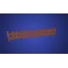 | `picket_fence` | prop | 5.02 × 1 × 0.14 | `props/nature/picket_fence.glb` | CC0 1.0 |
| 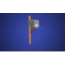 | `mailbox` | prop | 0.19 × 1.2 × 0.59 | `props/street/mailbox.glb` | CC0 1.0 |
| 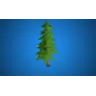 | `tree_pine` | prop | 4.53 × 8 × 4.2 | `props/nature/tree_pine.glb` | CC0 1.0 |
|  | `bush` | prop | 1.74 × 1 × 1.74 | `props/nature/bush.glb` | CC0 1.0 |
|  | `houseplant_big` | prop | 1.45 × 1.1 × 1.52 | `props/interior/houseplant_big.glb` | CC0 1.0 |
|  | `couch_leather` | prop | 2.2 × 0.85 × 0.8 | `props/interior/couch_leather.glb` | CC0 1.0 |
|  | `picture_frame` | prop | 0.36 × 0.5 × 0.02 | `props/interior/picture_frame.glb` | CC0 1.0 |
|  | `table_lamp_shade` | prop | 0.29 × 0.6 × 0.29 | `props/interior/table_lamp_shade.glb` | CC0 1.0 |
| 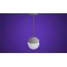 | `pendant_light` | prop | 0.32 × 0.9 × 0.32 | `props/interior/pendant_light.glb` | CC0 1.0 |
|  | `gift_bow` | prop | 0.41 × 0.4 × 0.4 | `props/events/gift_bow.glb` | CC0 1.0 |
| 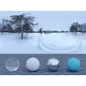 | `hdri_snow_day` | hdri | — | `env/hdri/hdri_snow_day.hdr` | CC0 1.0 |
| 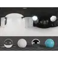 | `hdri_studio` | hdri | — | `env/hdri/hdri_studio.hdr` | CC0 1.0 |
|  | `tex_wood_floor` | texture | 1.7 × 0 × 1.7 | `textures/wood_floor/` | CC0 1.0 |
|  | `tex_floor_tiles` | texture | 4 × 0 × 4 | `textures/floor_tiles/` | CC0 1.0 |
|  | `tex_plaster` | texture | 2 × 0 × 2 | `textures/plaster/` | CC0 1.0 |
| 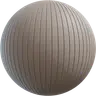 | `tex_siding` | texture | 1.8 × 0 × 1.8 | `textures/siding/` | CC0 1.0 |
|  | `tex_snow` | texture | 2 × 0 × 2 | `textures/snow/` | CC0 1.0 |

## work — open-plan tech office

| | id | kind | dims (m) | file | licence |
|---|---|---|---|---|---|
|  | `sofa` | prop | 2.16 × 1.01 × 0.9 | `props/kenney-furniture/sofa.glb` | CC0 1.0 |
|  | `sofa_long` | prop | 2.16 × 1.01 × 1.8 | `props/kenney-furniture/sofa_long.glb` | CC0 1.0 |
|  | `sofa_corner` | prop | 2.16 × 1.01 × 2.16 | `props/kenney-furniture/sofa_corner.glb` | CC0 1.0 |
| 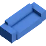 | `sofa_modern` | prop | 2.46 × 0.88 × 0.9 | `props/kenney-furniture/sofa_modern.glb` | CC0 1.0 |
|  | `armchair` | prop | 1.08 × 1.01 × 0.9 | `props/kenney-furniture/armchair.glb` | CC0 1.0 |
| 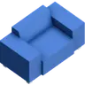 | `armchair_modern` | prop | 1.61 × 0.88 × 0.9 | `props/kenney-furniture/armchair_modern.glb` | CC0 1.0 |
|  | `table_round` | prop | 1.52 × 0.81 × 1.76 | `props/kenney-furniture/table_round.glb` | CC0 1.0 |
| 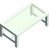 | `table_glass` | prop | 1.85 × 0.72 × 0.98 | `props/kenney-furniture/table_glass.glb` | CC0 1.0 |
|  | `coffee_table` | prop | 1.45 × 0.51 × 0.88 | `props/kenney-furniture/coffee_table.glb` | CC0 1.0 |
|  | `coffee_table_glass` | prop | 1.45 × 0.51 × 0.88 | `props/kenney-furniture/coffee_table_glass.glb` | CC0 1.0 |
|  | `side_table_drawers` | prop | 1.18 × 0.85 × 0.49 | `props/kenney-furniture/side_table_drawers.glb` | CC0 1.0 |
|  | `chair_modern` | prop | 0.44 × 1.01 × 0.44 | `props/kenney-furniture/chair_modern.glb` | CC0 1.0 |
|  | `chair_modern_frame` | prop | 0.44 × 1.01 × 0.44 | `props/kenney-furniture/chair_modern_frame.glb` | CC0 1.0 |
|  | `chair_desk` | prop | 0.74 × 1.34 × 0.69 | `props/kenney-furniture/chair_desk.glb` | CC0 1.0 |
|  | `stool_bar` | prop | 0.58 × 0.96 × 0.51 | `props/kenney-furniture/stool_bar.glb` | CC0 1.0 |
|  | `bench_cushion` | prop | 0.88 × 1.01 × 0.44 | `props/kenney-furniture/bench_cushion.glb` | CC0 1.0 |
|  | `desk` | prop | 1.62 × 0.85 × 0.86 | `props/kenney-furniture/desk.glb` | CC0 1.0 |
| 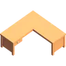 | `desk_corner` | prop | 2.14 × 0.85 × 2.14 | `props/kenney-furniture/desk_corner.glb` | CC0 1.0 |
|  | `kitchen_cabinet` | prop | 0.95 × 0.99 × 0.99 | `props/kenney-furniture/kitchen_cabinet.glb` | CC0 1.0 |
|  | `kitchen_cabinet_drawer` | prop | 0.95 × 0.99 × 0.99 | `props/kenney-furniture/kitchen_cabinet_drawer.glb` | CC0 1.0 |
|  | `kitchen_cabinet_corner` | prop | 1.01 × 0.99 × 1.01 | `props/kenney-furniture/kitchen_cabinet_corner.glb` | CC0 1.0 |
|  | `kitchen_cabinet_upper` | prop | 0.95 × 0.86 × 0.48 | `props/kenney-furniture/kitchen_cabinet_upper.glb` | CC0 1.0 |
|  | `kitchen_cabinet_upper_double` | prop | 0.95 × 0.86 × 0.48 | `props/kenney-furniture/kitchen_cabinet_upper_double.glb` | CC0 1.0 |
|  | `kitchen_bar` | prop | 0.95 × 0.92 × 0.46 | `props/kenney-furniture/kitchen_bar.glb` | CC0 1.0 |
|  | `kitchen_bar_end` | prop | 0.22 × 0.92 × 0.46 | `props/kenney-furniture/kitchen_bar_end.glb` | CC0 1.0 |
|  | `kitchen_sink` | prop | 0.95 × 1.08 × 0.99 | `props/kenney-furniture/kitchen_sink.glb` | CC0 1.0 |
|  | `stove_electric` | prop | 0.95 × 0.99 × 0.99 | `props/kenney-furniture/stove_electric.glb` | CC0 1.0 |
|  | `fridge` | prop | 1.14 × 2.02 × 0.89 | `props/kenney-furniture/fridge.glb` | CC0 1.0 |
|  | `fridge_small` | prop | 0.95 × 1.32 × 0.64 | `props/kenney-furniture/fridge_small.glb` | CC0 1.0 |
|  | `microwave` | prop | 0.64 × 0.4 × 0.51 | `props/kenney-furniture/microwave.glb` | CC0 1.0 |
|  | `coffee_machine` | prop | 0.42 × 0.39 × 0.53 | `props/kenney-furniture/coffee_machine.glb` | CC0 1.0 |
|  | `bookcase` | prop | 0.88 × 1.94 × 0.55 | `props/kenney-furniture/bookcase.glb` | CC0 1.0 |
|  | `bookcase_low` | prop | 0.88 × 0.88 × 0.55 | `props/kenney-furniture/bookcase_low.glb` | CC0 1.0 |
|  | `bookcase_wide_closed` | prop | 1.76 × 1.74 × 0.55 | `props/kenney-furniture/bookcase_wide_closed.glb` | CC0 1.0 |
|  | `bookcase_doors` | prop | 0.88 × 1.87 × 0.55 | `props/kenney-furniture/bookcase_doors.glb` | CC0 1.0 |
|  | `books` | prop | 0.33 × 0.23 × 0.21 | `props/kenney-furniture/books.glb` | CC0 1.0 |
|  | `tv` | prop | 1.51 × 1 × 0.28 | `props/kenney-furniture/tv.glb` | CC0 1.0 |
|  | `lamp_floor_round` | prop | 0.33 × 1.89 × 0.39 | `props/kenney-furniture/lamp_floor_round.glb` | CC0 1.0 |
|  | `lamp_floor_square` | prop | 0.26 × 1.89 × 0.26 | `props/kenney-furniture/lamp_floor_square.glb` | CC0 1.0 |
|  | `lamp_table_square` | prop | 0.26 × 0.64 × 0.26 | `props/kenney-furniture/lamp_table_square.glb` | CC0 1.0 |
|  | `lamp_ceiling` | prop | 0.26 × 0.51 × 0.26 | `props/kenney-furniture/lamp_ceiling.glb` | CC0 1.0 |
|  | `plant_potted` | prop | 0.47 × 1.44 × 0.53 | `props/kenney-furniture/plant_potted.glb` | CC0 1.0 |
|  | `plant_small_1` | prop | 0.21 × 0.31 × 0.21 | `props/kenney-furniture/plant_small_1.glb` | CC0 1.0 |
|  | `plant_small_2` | prop | 0.21 × 0.31 × 0.21 | `props/kenney-furniture/plant_small_2.glb` | CC0 1.0 |
|  | `plant_small_3` | prop | 0.22 × 0.32 × 0.19 | `props/kenney-furniture/plant_small_3.glb` | CC0 1.0 |
|  | `rug_rect` | prop | 3.45 × 0.02 × 2.02 | `props/kenney-furniture/rug_rect.glb` | CC0 1.0 |
|  | `laptop` | prop | 0.58 × 0.36 × 0.53 | `props/kenney-furniture/laptop.glb` | CC0 1.0 |
|  | `monitor` | prop | 0.86 × 0.65 × 0.23 | `props/kenney-furniture/monitor.glb` | CC0 1.0 |
|  | `keyboard` | prop | 0.62 × 0.06 × 0.26 | `props/kenney-furniture/keyboard.glb` | CC0 1.0 |
|  | `mouse` | prop | 0.11 × 0.05 × 0.19 | `props/kenney-furniture/mouse.glb` | CC0 1.0 |
|  | `speaker_small` | prop | 0.33 × 0.66 × 0.29 | `props/kenney-furniture/speaker_small.glb` | CC0 1.0 |
|  | `stairs_open` | prop | 4.01 × 2.95 × 1.74 | `props/kenney-furniture/stairs_open.glb` | CC0 1.0 |
|  | `doorway` | prop | 1.07 × 2.22 × 0.25 | `props/kenney-furniture/doorway.glb` | CC0 1.0 |
|  | `doorway_open` | prop | 1.07 × 2.22 × 0.2 | `props/kenney-furniture/doorway_open.glb` | CC0 1.0 |
|  | `wall_window` | prop | 2.2 × 2.84 × 0.2 | `props/kenney-furniture/wall_window.glb` | CC0 1.0 |
|  | `wall` | prop | 2.2 × 2.84 × 0.11 | `props/kenney-furniture/wall.glb` | CC0 1.0 |
|  | `wall_doorway` | prop | 2.2 × 2.84 × 0.2 | `props/kenney-furniture/wall_doorway.glb` | CC0 1.0 |
|  | `coat_rack_standing` | prop | 0.6 × 1.69 × 0.6 | `props/kenney-furniture/coat_rack_standing.glb` | CC0 1.0 |
|  | `cardboard_box` | prop | 0.47 × 0.62 × 0.47 | `props/kenney-furniture/cardboard_box.glb` | CC0 1.0 |
|  | `cardboard_box_open` | prop | 0.82 × 0.62 × 0.47 | `props/kenney-furniture/cardboard_box_open.glb` | CC0 1.0 |
|  | `trashcan_small` | prop | 0.46 × 0.94 × 0.52 | `props/kenney-furniture/trashcan_small.glb` | CC0 1.0 |
|  | `mug` | prop | 0.13 × 0.1 × 0.1 | `props/kenney-food/mug.glb` | CC0 1.0 |
|  | `coffee_cup` | prop | 0.19 × 0.12 × 0.25 | `props/kenney-food/coffee_cup.glb` | CC0 1.0 |
|  | `pizza_box` | prop | 0.4 × 0.37 × 0.4 | `props/kenney-food/pizza_box.glb` | CC0 1.0 |
| 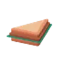 | `sandwich` | prop | 0.15 × 0.06 × 0.15 | `props/kenney-food/sandwich.glb` | CC0 1.0 |
|  | `donut` | prop | 0.09 × 0.03 × 0.1 | `props/kenney-food/donut.glb` | CC0 1.0 |
|  | `christmas_tree_small` | prop | 0.83 × 1.6 × 0.83 | `props/kenney-holiday/christmas_tree_small.glb` | CC0 1.0 |
|  | `office_building_f` | prop | 6.72 × 13.54 × 8.24 | `props/kenney-commercial/office_building_f.glb` | CC0 1.0 |
| 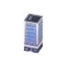 | `skyscraper_a` | prop | 10.88 × 23.04 × 10.88 | `props/kenney-commercial/skyscraper_a.glb` | CC0 1.0 |
|  | `backdrop_tower_a` | prop | 4 × 16 × 4 | `props/kenney-commercial/backdrop_tower_a.glb` | CC0 1.0 |
|  | `backdrop_tower_wide` | prop | 8 × 8.8 × 4 | `props/kenney-commercial/backdrop_tower_wide.glb` | CC0 1.0 |
|  | `car_sedan` | prop | 1.97 × 1.28 × 4.6 | `props/vehicles/car_sedan.glb` | CC0 1.0 |
|  | `houseplant_big` | prop | 1.45 × 1.1 × 1.52 | `props/interior/houseplant_big.glb` | CC0 1.0 |
|  | `office_chair` | prop | 0.7 × 1.1 × 0.79 | `props/interior/office_chair.glb` | CC0 1.0 |
|  | `couch_leather` | prop | 2.2 × 0.85 × 0.8 | `props/interior/couch_leather.glb` | CC0 1.0 |
|  | `picture_frame` | prop | 0.36 × 0.5 × 0.02 | `props/interior/picture_frame.glb` | CC0 1.0 |
|  | `corkboard` | prop | 1.2 × 0.83 × 0.05 | `props/interior/corkboard.glb` | CC0 1.0 |
| 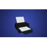 | `printer` | prop | 0.35 × 0.26 × 0.5 | `props/interior/printer.glb` | CC0 1.0 |
|  | `pendant_light` | prop | 0.32 × 0.9 × 0.32 | `props/interior/pendant_light.glb` | CC0 1.0 |
|  | `drinks_fridge` | prop | 1.02 × 1.9 × 0.58 | `props/interior/drinks_fridge.glb` | CC0 1.0 |
|  | `whiteboard` | prop | 0.15 × 1.26 × 1.8 | `props/interior/whiteboard.glb` | CC-BY 3.0 ⚠️ |
| 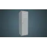 | `locker` | prop | 0.61 × 1.8 × 0.56 | `props/interior/locker.glb` | CC-BY 3.0 ⚠️ |
|  | `water_cooler` | prop | 0.27 × 1.15 × 0.31 | `props/interior/water_cooler.glb` | CC-BY 3.0 ⚠️ |
|  | `file_cabinet` | prop | 0.64 × 1.3 × 0.55 | `props/interior/file_cabinet.glb` | CC-BY 3.0 ⚠️ |
| 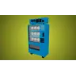 | `vending_machine` | prop | 1 × 1.85 × 0.48 | `props/interior/vending_machine.glb` | CC-BY 3.0 ⚠️ |
| 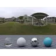 | `hdri_suburb_day` | hdri | — | `env/hdri/hdri_suburb_day.hdr` | CC0 1.0 |
|  | `hdri_studio` | hdri | — | `env/hdri/hdri_studio.hdr` | CC0 1.0 |
|  | `tex_laminate` | texture | 1.7 × 0 × 1.7 | `textures/laminate/` | CC0 1.0 |
|  | `tex_carpet` | texture | 0.6 × 0 × 0.6 | `textures/carpet/` | CC0 1.0 |
|  | `tex_plaster` | texture | 2 × 0 × 2 | `textures/plaster/` | CC0 1.0 |

## school — community college (evening)

| | id | kind | dims (m) | file | licence |
|---|---|---|---|---|---|
|  | `dining_table` | prop | 1.85 × 0.72 × 0.98 | `props/kenney-furniture/dining_table.glb` | CC0 1.0 |
|  | `table_round` | prop | 1.52 × 0.81 × 1.76 | `props/kenney-furniture/table_round.glb` | CC0 1.0 |
|  | `chair` | prop | 0.44 × 1.03 × 0.44 | `props/kenney-furniture/chair.glb` | CC0 1.0 |
|  | `chair_modern` | prop | 0.44 × 1.01 × 0.44 | `props/kenney-furniture/chair_modern.glb` | CC0 1.0 |
|  | `chair_modern_frame` | prop | 0.44 × 1.01 × 0.44 | `props/kenney-furniture/chair_modern_frame.glb` | CC0 1.0 |
|  | `chair_rounded` | prop | 0.44 × 1 × 0.44 | `props/kenney-furniture/chair_rounded.glb` | CC0 1.0 |
|  | `chair_desk` | prop | 0.74 × 1.34 × 0.69 | `props/kenney-furniture/chair_desk.glb` | CC0 1.0 |
|  | `bench_cushion` | prop | 0.88 × 1.01 × 0.44 | `props/kenney-furniture/bench_cushion.glb` | CC0 1.0 |
|  | `desk` | prop | 1.62 × 0.85 × 0.86 | `props/kenney-furniture/desk.glb` | CC0 1.0 |
|  | `desk_corner` | prop | 2.14 × 0.85 × 2.14 | `props/kenney-furniture/desk_corner.glb` | CC0 1.0 |
|  | `fridge_small` | prop | 0.95 × 1.32 × 0.64 | `props/kenney-furniture/fridge_small.glb` | CC0 1.0 |
|  | `bookcase` | prop | 0.88 × 1.94 × 0.55 | `props/kenney-furniture/bookcase.glb` | CC0 1.0 |
|  | `bookcase_low` | prop | 0.88 × 0.88 × 0.55 | `props/kenney-furniture/bookcase_low.glb` | CC0 1.0 |
|  | `bookcase_wide_closed` | prop | 1.76 × 1.74 × 0.55 | `props/kenney-furniture/bookcase_wide_closed.glb` | CC0 1.0 |
|  | `bookcase_doors` | prop | 0.88 × 1.87 × 0.55 | `props/kenney-furniture/bookcase_doors.glb` | CC0 1.0 |
|  | `books` | prop | 0.33 × 0.23 × 0.21 | `props/kenney-furniture/books.glb` | CC0 1.0 |
|  | `lamp_ceiling` | prop | 0.26 × 0.51 × 0.26 | `props/kenney-furniture/lamp_ceiling.glb` | CC0 1.0 |
|  | `plant_potted` | prop | 0.47 × 1.44 × 0.53 | `props/kenney-furniture/plant_potted.glb` | CC0 1.0 |
|  | `laptop` | prop | 0.58 × 0.36 × 0.53 | `props/kenney-furniture/laptop.glb` | CC0 1.0 |
|  | `monitor` | prop | 0.86 × 0.65 × 0.23 | `props/kenney-furniture/monitor.glb` | CC0 1.0 |
|  | `keyboard` | prop | 0.62 × 0.06 × 0.26 | `props/kenney-furniture/keyboard.glb` | CC0 1.0 |
|  | `mouse` | prop | 0.11 × 0.05 × 0.19 | `props/kenney-furniture/mouse.glb` | CC0 1.0 |
|  | `doorway` | prop | 1.07 × 2.22 × 0.25 | `props/kenney-furniture/doorway.glb` | CC0 1.0 |
|  | `doorway_open` | prop | 1.07 × 2.22 × 0.2 | `props/kenney-furniture/doorway_open.glb` | CC0 1.0 |
|  | `wall_window` | prop | 2.2 × 2.84 × 0.2 | `props/kenney-furniture/wall_window.glb` | CC0 1.0 |
|  | `wall` | prop | 2.2 × 2.84 × 0.11 | `props/kenney-furniture/wall.glb` | CC0 1.0 |
|  | `wall_doorway` | prop | 2.2 × 2.84 × 0.2 | `props/kenney-furniture/wall_doorway.glb` | CC0 1.0 |
|  | `coat_rack_wall` | prop | 0.99 × 0.62 × 0.3 | `props/kenney-furniture/coat_rack_wall.glb` | CC0 1.0 |
|  | `trashcan_small` | prop | 0.46 × 0.94 × 0.52 | `props/kenney-furniture/trashcan_small.glb` | CC0 1.0 |
|  | `bench_wood` | prop | 0.88 × 1.03 × 0.44 | `props/kenney-furniture/bench_wood.glb` | CC0 1.0 |
|  | `mug` | prop | 0.13 × 0.1 × 0.1 | `props/kenney-food/mug.glb` | CC0 1.0 |
|  | `coffee_cup` | prop | 0.19 × 0.12 × 0.25 | `props/kenney-food/coffee_cup.glb` | CC0 1.0 |
|  | `soda_can` | prop | 0.08 × 0.12 × 0.08 | `props/kenney-food/soda_can.glb` | CC0 1.0 |
|  | `pizza_box` | prop | 0.4 × 0.37 × 0.4 | `props/kenney-food/pizza_box.glb` | CC0 1.0 |
|  | `chips_bag` | prop | 0.09 × 0.25 × 0.17 | `props/kenney-food/chips_bag.glb` | CC0 1.0 |
|  | `store_checkout` | prop | 1.7 × 1.19 × 1.7 | `props/kenney-market/store_checkout.glb` | CC0 1.0 |
|  | `backdrop_tower_a` | prop | 4 × 16 × 4 | `props/kenney-commercial/backdrop_tower_a.glb` | CC0 1.0 |
|  | `backdrop_tower_wide` | prop | 8 × 8.8 × 4 | `props/kenney-commercial/backdrop_tower_wide.glb` | CC0 1.0 |
|  | `street_light_curved` | prop | 0.4 × 5.4 × 1.8 | `props/kenney-roads/street_light_curved.glb` | CC0 1.0 |
|  | `dumpster` | prop | 2.2 × 1.68 × 2.96 | `props/kenney-roads/dumpster.glb` | CC0 1.0 |
|  | `car_hatchback` | prop | 2.03 × 1.42 × 4.1 | `props/vehicles/car_hatchback.glb` | CC0 1.0 |
|  | `park_bench` | prop | 1.8 × 0.85 × 0.66 | `props/street/park_bench.glb` | CC0 1.0 |
| 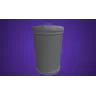 | `trash_can_street` | prop | 0.63 × 0.95 × 0.63 | `props/street/trash_can_street.glb` | CC0 1.0 |
|  | `street_light` | prop | 1.82 × 6.5 × 0.47 | `props/street/street_light.glb` | CC0 1.0 |
| 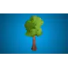 | `tree_leafy` | prop | 4.15 × 7 × 4.41 | `props/nature/tree_leafy.glb` | CC0 1.0 |
|  | `bush` | prop | 1.74 × 1 × 1.74 | `props/nature/bush.glb` | CC0 1.0 |
| 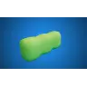 | `hedge` | prop | 2.67 × 1 × 1 | `props/nature/hedge.glb` | CC0 1.0 |
|  | `houseplant_big` | prop | 1.45 × 1.1 × 1.52 | `props/interior/houseplant_big.glb` | CC0 1.0 |
|  | `office_chair` | prop | 0.7 × 1.1 × 0.79 | `props/interior/office_chair.glb` | CC0 1.0 |
|  | `couch_leather` | prop | 2.2 × 0.85 × 0.8 | `props/interior/couch_leather.glb` | CC0 1.0 |
|  | `corkboard` | prop | 1.2 × 0.83 × 0.05 | `props/interior/corkboard.glb` | CC0 1.0 |
|  | `printer` | prop | 0.35 × 0.26 × 0.5 | `props/interior/printer.glb` | CC0 1.0 |
|  | `pendant_light` | prop | 0.32 × 0.9 × 0.32 | `props/interior/pendant_light.glb` | CC0 1.0 |
|  | `drinks_fridge` | prop | 1.02 × 1.9 × 0.58 | `props/interior/drinks_fridge.glb` | CC0 1.0 |
|  | `whiteboard` | prop | 0.15 × 1.26 × 1.8 | `props/interior/whiteboard.glb` | CC-BY 3.0 ⚠️ |
|  | `locker` | prop | 0.61 × 1.8 × 0.56 | `props/interior/locker.glb` | CC-BY 3.0 ⚠️ |
|  | `water_cooler` | prop | 0.27 × 1.15 × 0.31 | `props/interior/water_cooler.glb` | CC-BY 3.0 ⚠️ |
|  | `file_cabinet` | prop | 0.64 × 1.3 × 0.55 | `props/interior/file_cabinet.glb` | CC-BY 3.0 ⚠️ |
|  | `vending_machine` | prop | 1 × 1.85 × 0.48 | `props/interior/vending_machine.glb` | CC-BY 3.0 ⚠️ |
| 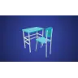 | `school_desk` | prop | 0.62 × 0.85 × 0.92 | `props/interior/school_desk.glb` | CC-BY 3.0 ⚠️ |
|  | `podium` | prop | 0.67 × 1.2 × 0.72 | `props/events/podium.glb` | CC-BY 3.0 ⚠️ |
| 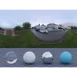 | `hdri_suburb_dusk` | hdri | — | `env/hdri/hdri_suburb_dusk.hdr` | CC0 1.0 |
|  | `hdri_studio` | hdri | — | `env/hdri/hdri_studio.hdr` | CC0 1.0 |
|  | `tex_laminate` | texture | 1.7 × 0 × 1.7 | `textures/laminate/` | CC0 1.0 |
|  | `tex_floor_tiles` | texture | 4 × 0 × 4 | `textures/floor_tiles/` | CC0 1.0 |
|  | `tex_carpet` | texture | 0.6 × 0 × 0.6 | `textures/carpet/` | CC0 1.0 |
|  | `tex_plaster` | texture | 2 × 0 × 2 | `textures/plaster/` | CC0 1.0 |
| 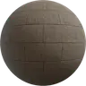 | `tex_sidewalk` | texture | 1.8 × 0 × 1.8 | `textures/sidewalk/` | CC0 1.0 |
| 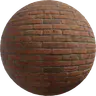 | `tex_brick` | texture | 1.4 × 0 × 1.4 | `textures/brick/` | CC0 1.0 |
|  | `tex_grass` | texture | 2 × 0 × 2 | `textures/grass/` | CC0 1.0 |

## street — city street at night

| | id | kind | dims (m) | file | licence |
|---|---|---|---|---|---|
|  | `cardboard_box` | prop | 0.47 × 0.62 × 0.47 | `props/kenney-furniture/cardboard_box.glb` | CC0 1.0 |
|  | `coffee_cup` | prop | 0.19 × 0.12 × 0.25 | `props/kenney-food/coffee_cup.glb` | CC0 1.0 |
|  | `wine_bottle_red` | prop | 0.08 × 0.3 × 0.07 | `props/kenney-food/wine_bottle_red.glb` | CC0 1.0 |
|  | `soda_can` | prop | 0.08 × 0.12 × 0.08 | `props/kenney-food/soda_can.glb` | CC0 1.0 |
|  | `soda_bottle` | prop | 0.09 × 0.3 × 0.08 | `props/kenney-food/soda_bottle.glb` | CC0 1.0 |
|  | `bread` | prop | 0.3 × 0.23 × 0.19 | `props/kenney-food/bread.glb` | CC0 1.0 |
|  | `sandwich` | prop | 0.15 × 0.06 × 0.15 | `props/kenney-food/sandwich.glb` | CC0 1.0 |
|  | `hot_dog` | prop | 0.18 × 0.05 × 0.06 | `props/kenney-food/hot_dog.glb` | CC0 1.0 |
|  | `donut` | prop | 0.09 × 0.03 × 0.1 | `props/kenney-food/donut.glb` | CC0 1.0 |
|  | `chips_bag` | prop | 0.09 × 0.25 × 0.17 | `props/kenney-food/chips_bag.glb` | CC0 1.0 |
|  | `candy_bar` | prop | 0.14 × 0.03 × 0.04 | `props/kenney-food/candy_bar.glb` | CC0 1.0 |
|  | `tree_snow` | prop | 3.1 × 5 × 3.1 | `props/kenney-holiday/tree_snow.glb` | CC0 1.0 |
|  | `snow_pile` | prop | 1.49 × 0.3 × 1.67 | `props/kenney-holiday/snow_pile.glb` | CC0 1.0 |
|  | `store_shelf_boxes` | prop | 1.6 × 1.7 × 1.4 | `props/kenney-market/store_shelf_boxes.glb` | CC0 1.0 |
|  | `store_shelf_bags` | prop | 1.6 × 1.78 × 1.4 | `props/kenney-market/store_shelf_bags.glb` | CC0 1.0 |
|  | `store_shelf_end` | prop | 1.6 × 2.1 × 0.8 | `props/kenney-market/store_shelf_end.glb` | CC0 1.0 |
|  | `store_cooler` | prop | 2 × 1.8 × 1 | `props/kenney-market/store_cooler.glb` | CC0 1.0 |
|  | `store_freezer` | prop | 1.6 × 0.7 × 1.2 | `props/kenney-market/store_freezer.glb` | CC0 1.0 |
|  | `store_checkout` | prop | 1.7 × 1.19 × 1.7 | `props/kenney-market/store_checkout.glb` | CC0 1.0 |
|  | `store_display_fruit` | prop | 1.2 × 1.03 × 1.2 | `props/kenney-market/store_display_fruit.glb` | CC0 1.0 |
| 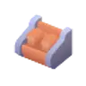 | `store_display_bread` | prop | 1.4 × 1 × 1.2 | `props/kenney-market/store_display_bread.glb` | CC0 1.0 |
|  | `shopping_basket` | prop | 0.7 × 0.5 × 0.7 | `props/kenney-market/shopping_basket.glb` | CC0 1.0 |
|  | `shopping_cart` | prop | 0.6 × 0.78 × 0.96 | `props/kenney-market/shopping_cart.glb` | CC0 1.0 |
|  | `store_wall` | prop | 2 × 2 × 1.2 | `props/kenney-market/store_wall.glb` | CC0 1.0 |
|  | `store_wall_window` | prop | 2 × 2 × 1.2 | `props/kenney-market/store_wall_window.glb` | CC0 1.0 |
|  | `store_wall_door` | prop | 2 × 2 × 1.2 | `props/kenney-market/store_wall_door.glb` | CC0 1.0 |
|  | `store_wall_corner` | prop | 1.6 × 2 × 1.6 | `props/kenney-market/store_wall_corner.glb` | CC0 1.0 |
|  | `store_floor` | prop | 2 × 0.05 × 2 | `props/kenney-market/store_floor.glb` | CC0 1.0 |
|  | `store_column` | prop | 1.45 × 2 × 1.45 | `props/kenney-market/store_column.glb` | CC0 1.0 |
| 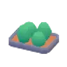 | `planter` | prop | 3.2 × 1.42 × 2.4 | `props/kenney-suburban/planter.glb` | CC0 1.0 |
|  | `tree_suburban_large` | prop | 1.68 × 6.14 × 1.94 | `props/kenney-suburban/tree_suburban_large.glb` | CC0 1.0 |
|  | `tree_suburban_small` | prop | 1.68 × 4.54 × 1.94 | `props/kenney-suburban/tree_suburban_small.glb` | CC0 1.0 |
|  | `store_building_a` | prop | 7.07 × 10.34 × 7.52 | `props/kenney-commercial/store_building_a.glb` | CC0 1.0 |
|  | `store_building_c` | prop | 7.07 × 7.14 × 8.72 | `props/kenney-commercial/store_building_c.glb` | CC0 1.0 |
|  | `store_building_e` | prop | 13.12 × 7.14 × 8.06 | `props/kenney-commercial/store_building_e.glb` | CC0 1.0 |
|  | `office_building_f` | prop | 6.72 × 13.54 × 8.24 | `props/kenney-commercial/office_building_f.glb` | CC0 1.0 |
|  | `office_building_h` | prop | 7.07 × 10.34 × 8.06 | `props/kenney-commercial/office_building_h.glb` | CC0 1.0 |
|  | `apartment_building_k` | prop | 16.67 × 11.76 × 7.54 | `props/kenney-commercial/apartment_building_k.glb` | CC0 1.0 |
|  | `skyscraper_a` | prop | 10.88 × 23.04 × 10.88 | `props/kenney-commercial/skyscraper_a.glb` | CC0 1.0 |
|  | `backdrop_tower_a` | prop | 4 × 16 × 4 | `props/kenney-commercial/backdrop_tower_a.glb` | CC0 1.0 |
|  | `backdrop_tower_wide` | prop | 8 × 8.8 × 4 | `props/kenney-commercial/backdrop_tower_wide.glb` | CC0 1.0 |
|  | `awning` | prop | 3.2 × 3.2 × 1.18 | `props/kenney-commercial/awning.glb` | CC0 1.0 |
|  | `awning_wide` | prop | 6.4 × 3.2 × 1.18 | `props/kenney-commercial/awning_wide.glb` | CC0 1.0 |
|  | `canopy_wide` | prop | 8 × 3.2 × 1.6 | `props/kenney-commercial/canopy_wide.glb` | CC0 1.0 |
|  | `parasol` | prop | 2.77 × 3.6 × 3.2 | `props/kenney-commercial/parasol.glb` | CC0 1.0 |
| 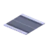 | `road_straight` | prop | 8 × 0.16 × 8 | `props/kenney-roads/road_straight.glb` | CC0 1.0 |
|  | `road_crossroad` | prop | 8 × 0.16 × 8 | `props/kenney-roads/road_crossroad.glb` | CC0 1.0 |
| 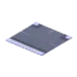 | `road_intersection` | prop | 8 × 0.16 × 8 | `props/kenney-roads/road_intersection.glb` | CC0 1.0 |
| 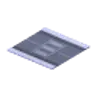 | `road_crossing` | prop | 8 × 0.16 × 8 | `props/kenney-roads/road_crossing.glb` | CC0 1.0 |
|  | `road_bend` | prop | 8 × 0.16 × 8 | `props/kenney-roads/road_bend.glb` | CC0 1.0 |
|  | `road_end` | prop | 8 × 0.16 × 8 | `props/kenney-roads/road_end.glb` | CC0 1.0 |
| 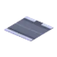 | `road_driveway` | prop | 8 × 0.16 × 8 | `props/kenney-roads/road_driveway.glb` | CC0 1.0 |
| 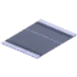 | `road_side` | prop | 8 × 0.16 × 10.48 | `props/kenney-roads/road_side.glb` | CC0 1.0 |
|  | `sidewalk_tile` | prop | 8 × 0.16 × 8 | `props/kenney-roads/sidewalk_tile.glb` | CC0 1.0 |
|  | `street_light_double` | prop | 0.4 × 4.8 × 3.4 | `props/kenney-roads/street_light_double.glb` | CC0 1.0 |
|  | `street_light_curved` | prop | 0.4 × 5.4 × 1.8 | `props/kenney-roads/street_light_curved.glb` | CC0 1.0 |
|  | `traffic_light` | prop | 0.94 × 4.12 × 0.72 | `props/kenney-roads/traffic_light.glb` | CC0 1.0 |
|  | `traffic_light_hanging` | prop | 0.94 × 4.07 × 2.36 | `props/kenney-roads/traffic_light_hanging.glb` | CC0 1.0 |
|  | `stop_sign` | prop | 0.62 × 3.95 × 1.11 | `props/kenney-roads/stop_sign.glb` | CC0 1.0 |
|  | `street_sign` | prop | 1.57 × 3.8 × 1.57 | `props/kenney-roads/street_sign.glb` | CC0 1.0 |
|  | `cone` | prop | 0.6 × 0.75 × 0.6 | `props/kenney-roads/cone.glb` | CC0 1.0 |
|  | `barrier` | prop | 1.08 × 1.04 × 1.8 | `props/kenney-roads/barrier.glb` | CC0 1.0 |
|  | `dumpster` | prop | 2.2 × 1.68 × 2.96 | `props/kenney-roads/dumpster.glb` | CC0 1.0 |
|  | `utility_pole` | prop | 4.63 × 4.2 × 1.71 | `props/kenney-roads/utility_pole.glb` | CC0 1.0 |
|  | `car_sedan` | prop | 1.97 × 1.28 × 4.6 | `props/vehicles/car_sedan.glb` | CC0 1.0 |
|  | `car_hatchback` | prop | 2.03 × 1.42 × 4.1 | `props/vehicles/car_hatchback.glb` | CC0 1.0 |
|  | `car_suv` | prop | 2.41 × 1.74 × 4.8 | `props/vehicles/car_suv.glb` | CC0 1.0 |
|  | `car_police` | prop | 2.38 × 1.66 × 5 | `props/vehicles/car_police.glb` | CC0 1.0 |
|  | `fire_hydrant` | prop | 0.5 × 0.75 × 0.39 | `props/street/fire_hydrant.glb` | CC0 1.0 |
|  | `park_bench` | prop | 1.8 × 0.85 × 0.66 | `props/street/park_bench.glb` | CC0 1.0 |
|  | `trash_can_street` | prop | 0.63 × 0.95 × 0.63 | `props/street/trash_can_street.glb` | CC0 1.0 |
|  | `street_light` | prop | 1.82 × 6.5 × 0.47 | `props/street/street_light.glb` | CC0 1.0 |
|  | `traffic_light_pole` | prop | 4.94 × 6 × 1.68 | `props/street/traffic_light_pole.glb` | CC0 1.0 |
|  | `tree_leafy` | prop | 4.15 × 7 × 4.41 | `props/nature/tree_leafy.glb` | CC0 1.0 |
|  | `tree_pine` | prop | 4.53 × 8 × 4.2 | `props/nature/tree_pine.glb` | CC0 1.0 |
|  | `bush` | prop | 1.74 × 1 × 1.74 | `props/nature/bush.glb` | CC0 1.0 |
|  | `drinks_fridge` | prop | 1.02 × 1.9 × 0.58 | `props/interior/drinks_fridge.glb` | CC0 1.0 |
|  | `vending_machine` | prop | 1 × 1.85 × 0.48 | `props/interior/vending_machine.glb` | CC-BY 3.0 ⚠️ |
|  | `bus_shelter` | prop | 3.66 × 2.6 × 2.37 | `props/street/bus_shelter.glb` | CC-BY 3.0 ⚠️ |
|  | `ebike` | prop | 0.64 × 1.07 × 1.85 | `props/vehicles/ebike.glb` | CC-BY 3.0 ⚠️ |
|  | `hdri_city_night` | hdri | — | `env/hdri/hdri_city_night.hdr` | CC0 1.0 |
|  | `tex_floor_tiles` | texture | 4 × 0 × 4 | `textures/floor_tiles/` | CC0 1.0 |
|  | `tex_asphalt` | texture | 3 × 0 × 3 | `textures/asphalt/` | CC0 1.0 |
|  | `tex_sidewalk` | texture | 1.8 × 0 × 1.8 | `textures/sidewalk/` | CC0 1.0 |
|  | `tex_brick` | texture | 1.4 × 0 × 1.4 | `textures/brick/` | CC0 1.0 |
|  | `tex_snow` | texture | 2 × 0 × 2 | `textures/snow/` | CC0 1.0 |

## public_events — hotel ballroom holiday party

| | id | kind | dims (m) | file | licence |
|---|---|---|---|---|---|
|  | `sofa_modern` | prop | 2.46 × 0.88 × 0.9 | `props/kenney-furniture/sofa_modern.glb` | CC0 1.0 |
|  | `armchair_modern` | prop | 1.61 × 0.88 × 0.9 | `props/kenney-furniture/armchair_modern.glb` | CC0 1.0 |
|  | `table_cloth` | prop | 1.85 × 0.72 × 0.98 | `props/kenney-furniture/table_cloth.glb` | CC0 1.0 |
|  | `table_cross_cloth` | prop | 1.87 × 0.76 × 0.98 | `props/kenney-furniture/table_cross_cloth.glb` | CC0 1.0 |
|  | `chair_cushion` | prop | 0.44 × 1.01 × 0.44 | `props/kenney-furniture/chair_cushion.glb` | CC0 1.0 |
|  | `chair_modern` | prop | 0.44 × 1.01 × 0.44 | `props/kenney-furniture/chair_modern.glb` | CC0 1.0 |
|  | `chair_modern_frame` | prop | 0.44 × 1.01 × 0.44 | `props/kenney-furniture/chair_modern_frame.glb` | CC0 1.0 |
|  | `tv` | prop | 1.51 × 1 × 0.28 | `props/kenney-furniture/tv.glb` | CC0 1.0 |
|  | `lamp_wall` | prop | 0.5 × 0.2 × 0.33 | `props/kenney-furniture/lamp_wall.glb` | CC0 1.0 |
|  | `plant_potted` | prop | 0.47 × 1.44 × 0.53 | `props/kenney-furniture/plant_potted.glb` | CC0 1.0 |
|  | `speaker_small` | prop | 0.33 × 0.66 × 0.29 | `props/kenney-furniture/speaker_small.glb` | CC0 1.0 |
|  | `speaker_tall` | prop | 0.33 × 1.4 × 0.33 | `props/kenney-furniture/speaker_tall.glb` | CC0 1.0 |
|  | `trashcan_small` | prop | 0.46 × 0.94 × 0.52 | `props/kenney-furniture/trashcan_small.glb` | CC0 1.0 |
|  | `cake_birthday` | prop | 0.3 × 0.17 × 0.3 | `props/kenney-food/cake_birthday.glb` | CC0 1.0 |
|  | `cake` | prop | 0.3 × 0.13 × 0.3 | `props/kenney-food/cake.glb` | CC0 1.0 |
|  | `cupcake` | prop | 0.07 × 0.08 × 0.06 | `props/kenney-food/cupcake.glb` | CC0 1.0 |
|  | `plate` | prop | 0.27 × 0.07 × 0.27 | `props/kenney-food/plate.glb` | CC0 1.0 |
|  | `wine_bottle_red` | prop | 0.08 × 0.3 × 0.07 | `props/kenney-food/wine_bottle_red.glb` | CC0 1.0 |
|  | `wine_glass` | prop | 0.09 × 0.2 × 0.08 | `props/kenney-food/wine_glass.glb` | CC0 1.0 |
|  | `turkey` | prop | 0.46 × 0.18 × 0.34 | `props/kenney-food/turkey.glb` | CC0 1.0 |
|  | `ham` | prop | 0.21 × 0.24 × 0.35 | `props/kenney-food/ham.glb` | CC0 1.0 |
|  | `salad_bowl` | prop | 0.22 × 0.12 × 0.25 | `props/kenney-food/salad_bowl.glb` | CC0 1.0 |
|  | `christmas_tree` | prop | 1.82 × 3.5 × 1.82 | `props/kenney-holiday/christmas_tree.glb` | CC0 1.0 |
|  | `gift_cube` | prop | 0.28 × 0.35 × 0.28 | `props/kenney-holiday/gift_cube.glb` | CC0 1.0 |
|  | `gift_rect` | prop | 0.35 × 0.25 × 0.24 | `props/kenney-holiday/gift_rect.glb` | CC0 1.0 |
|  | `gift_round` | prop | 0.29 × 0.3 × 0.29 | `props/kenney-holiday/gift_round.glb` | CC0 1.0 |
|  | `wreath` | prop | 0.53 × 0.6 × 0.2 | `props/kenney-holiday/wreath.glb` | CC0 1.0 |
|  | `string_lights` | prop | 2.02 × 0.63 × 0.13 | `props/kenney-holiday/string_lights.glb` | CC0 1.0 |
|  | `string_lights_red` | prop | 2.02 × 0.63 × 0.13 | `props/kenney-holiday/string_lights_red.glb` | CC0 1.0 |
|  | `candy_cane` | prop | 0.4 × 0.6 × 0.13 | `props/kenney-holiday/candy_cane.glb` | CC0 1.0 |
|  | `store_column` | prop | 1.45 × 2 × 1.45 | `props/kenney-market/store_column.glb` | CC0 1.0 |
|  | `houseplant_big` | prop | 1.45 × 1.1 × 1.52 | `props/interior/houseplant_big.glb` | CC0 1.0 |
|  | `picture_frame` | prop | 0.36 × 0.5 × 0.02 | `props/interior/picture_frame.glb` | CC0 1.0 |
|  | `table_lamp_shade` | prop | 0.29 × 0.6 × 0.29 | `props/interior/table_lamp_shade.glb` | CC0 1.0 |
|  | `chandelier` | prop | 1.4 × 1.23 × 1.4 | `props/events/chandelier.glb` | CC0 1.0 |
|  | `stage` | prop | 5 × 1.96 × 4.73 | `props/events/stage.glb` | CC0 1.0 |
|  | `mic_stand` | prop | 0.25 × 1.6 × 0.3 | `props/events/mic_stand.glb` | CC0 1.0 |
|  | `pa_speaker` | prop | 0.69 × 0.9 × 0.49 | `props/events/pa_speaker.glb` | CC0 1.0 |
|  | `gift_bow` | prop | 0.41 × 0.4 × 0.4 | `props/events/gift_bow.glb` | CC0 1.0 |
|  | `podium` | prop | 0.67 × 1.2 × 0.72 | `props/events/podium.glb` | CC-BY 3.0 ⚠️ |
|  | `balloons` | prop | 1.12 × 1.7 × 1.35 | `props/events/balloons.glb` | CC-BY 3.0 ⚠️ |
|  | `hdri_suburb_dusk` | hdri | — | `env/hdri/hdri_suburb_dusk.hdr` | CC0 1.0 |
|  | `hdri_ballroom` | hdri | — | `env/hdri/hdri_ballroom.hdr` | CC0 1.0 |
|  | `hdri_studio` | hdri | — | `env/hdri/hdri_studio.hdr` | CC0 1.0 |
|  | `tex_parquet` | texture | 3.4 × 0 × 3.4 | `textures/parquet/` | CC0 1.0 |
|  | `tex_carpet` | texture | 0.6 × 0 × 0.6 | `textures/carpet/` | CC0 1.0 |
|  | `tex_plaster` | texture | 2 × 0 × 2 | `textures/plaster/` | CC0 1.0 |

## private_events — suburban neighbourhood (condolence, birthday, wedding)

| | id | kind | dims (m) | file | licence |
|---|---|---|---|---|---|
|  | `table_cloth` | prop | 1.85 × 0.72 × 0.98 | `props/kenney-furniture/table_cloth.glb` | CC0 1.0 |
|  | `table_cross_cloth` | prop | 1.87 × 0.76 × 0.98 | `props/kenney-furniture/table_cross_cloth.glb` | CC0 1.0 |
|  | `chair` | prop | 0.44 × 1.03 × 0.44 | `props/kenney-furniture/chair.glb` | CC0 1.0 |
|  | `chair_cushion` | prop | 0.44 × 1.01 × 0.44 | `props/kenney-furniture/chair_cushion.glb` | CC0 1.0 |
|  | `chair_rounded` | prop | 0.44 × 1 × 0.44 | `props/kenney-furniture/chair_rounded.glb` | CC0 1.0 |
|  | `rug_rounded` | prop | 3.45 × 0.02 × 2.02 | `props/kenney-furniture/rug_rounded.glb` | CC0 1.0 |
|  | `doormat` | prop | 0.94 × 0.02 × 0.52 | `props/kenney-furniture/doormat.glb` | CC0 1.0 |
|  | `speaker_tall` | prop | 0.33 × 1.4 × 0.33 | `props/kenney-furniture/speaker_tall.glb` | CC0 1.0 |
|  | `doorway_front` | prop | 1.07 × 2.22 × 0.25 | `props/kenney-furniture/doorway_front.glb` | CC0 1.0 |
|  | `bench_wood` | prop | 0.88 × 1.03 × 0.44 | `props/kenney-furniture/bench_wood.glb` | CC0 1.0 |
|  | `cake_birthday` | prop | 0.3 × 0.17 × 0.3 | `props/kenney-food/cake_birthday.glb` | CC0 1.0 |
|  | `cake` | prop | 0.3 × 0.13 × 0.3 | `props/kenney-food/cake.glb` | CC0 1.0 |
|  | `cupcake` | prop | 0.07 × 0.08 × 0.06 | `props/kenney-food/cupcake.glb` | CC0 1.0 |
|  | `plate` | prop | 0.27 × 0.07 × 0.27 | `props/kenney-food/plate.glb` | CC0 1.0 |
|  | `wine_glass` | prop | 0.09 × 0.2 × 0.08 | `props/kenney-food/wine_glass.glb` | CC0 1.0 |
|  | `soda_can` | prop | 0.08 × 0.12 × 0.08 | `props/kenney-food/soda_can.glb` | CC0 1.0 |
|  | `soda_bottle` | prop | 0.09 × 0.3 × 0.08 | `props/kenney-food/soda_bottle.glb` | CC0 1.0 |
|  | `salad_bowl` | prop | 0.22 × 0.12 × 0.25 | `props/kenney-food/salad_bowl.glb` | CC0 1.0 |
|  | `hot_dog` | prop | 0.18 × 0.05 × 0.06 | `props/kenney-food/hot_dog.glb` | CC0 1.0 |
|  | `ketchup` | prop | 0.07 × 0.2 × 0.08 | `props/kenney-food/ketchup.glb` | CC0 1.0 |
|  | `tree_snow` | prop | 3.1 × 5 × 3.1 | `props/kenney-holiday/tree_snow.glb` | CC0 1.0 |
|  | `gift_cube` | prop | 0.28 × 0.35 × 0.28 | `props/kenney-holiday/gift_cube.glb` | CC0 1.0 |
|  | `gift_rect` | prop | 0.35 × 0.25 × 0.24 | `props/kenney-holiday/gift_rect.glb` | CC0 1.0 |
|  | `gift_round` | prop | 0.29 × 0.3 × 0.29 | `props/kenney-holiday/gift_round.glb` | CC0 1.0 |
|  | `string_lights` | prop | 2.02 × 0.63 × 0.13 | `props/kenney-holiday/string_lights.glb` | CC0 1.0 |
|  | `lantern_post` | prop | 0.67 × 2.2 × 0.58 | `props/kenney-holiday/lantern_post.glb` | CC0 1.0 |
|  | `snowman` | prop | 1.56 × 1.5 × 0.97 | `props/kenney-holiday/snowman.glb` | CC0 1.0 |
|  | `snow_pile` | prop | 1.49 × 0.3 × 1.67 | `props/kenney-holiday/snow_pile.glb` | CC0 1.0 |
|  | `house_a` | prop | 10.4 × 6.67 × 8.23 | `props/kenney-suburban/house_a.glb` | CC0 1.0 |
|  | `house_b` | prop | 14.62 × 9.1 × 9.12 | `props/kenney-suburban/house_b.glb` | CC0 1.0 |
|  | `house_g` | prop | 11.6 × 6.15 × 9.42 | `props/kenney-suburban/house_g.glb` | CC0 1.0 |
|  | `house_m` | prop | 11.42 × 5.9 × 11.42 | `props/kenney-suburban/house_m.glb` | CC0 1.0 |
|  | `house_n` | prop | 14.27 × 9.1 × 11.02 | `props/kenney-suburban/house_n.glb` | CC0 1.0 |
|  | `house_s` | prop | 11.25 × 9.1 × 8.69 | `props/kenney-suburban/house_s.glb` | CC0 1.0 |
|  | `fence_privacy` | prop | 3.8 × 2.16 × 0.6 | `props/kenney-suburban/fence_privacy.glb` | CC0 1.0 |
|  | `fence_yard_1x3` | prop | 10.2 × 2.16 × 3.5 | `props/kenney-suburban/fence_yard_1x3.glb` | CC0 1.0 |
|  | `picket_fence` | prop | 5.02 × 1 × 0.14 | `props/nature/picket_fence.glb` | CC0 1.0 |
|  | `driveway` | prop | 2.88 × 0.08 × 3.2 | `props/kenney-suburban/driveway.glb` | CC0 1.0 |
|  | `garden_path` | prop | 1.6 × 0.08 × 3.2 | `props/kenney-suburban/garden_path.glb` | CC0 1.0 |
|  | `garden_path_stones` | prop | 1.12 × 0.08 × 3.2 | `props/kenney-suburban/garden_path_stones.glb` | CC0 1.0 |
|  | `planter` | prop | 3.2 × 1.42 × 2.4 | `props/kenney-suburban/planter.glb` | CC0 1.0 |
|  | `tree_suburban_large` | prop | 1.68 × 6.14 × 1.94 | `props/kenney-suburban/tree_suburban_large.glb` | CC0 1.0 |
|  | `tree_suburban_small` | prop | 1.68 × 4.54 × 1.94 | `props/kenney-suburban/tree_suburban_small.glb` | CC0 1.0 |
|  | `parasol` | prop | 2.77 × 3.6 × 3.2 | `props/kenney-commercial/parasol.glb` | CC0 1.0 |
|  | `road_driveway` | prop | 8 × 0.16 × 8 | `props/kenney-roads/road_driveway.glb` | CC0 1.0 |
|  | `sidewalk_tile` | prop | 8 × 0.16 × 8 | `props/kenney-roads/sidewalk_tile.glb` | CC0 1.0 |
|  | `stop_sign` | prop | 0.62 × 3.95 × 1.11 | `props/kenney-roads/stop_sign.glb` | CC0 1.0 |
|  | `street_sign` | prop | 1.57 × 3.8 × 1.57 | `props/kenney-roads/street_sign.glb` | CC0 1.0 |
|  | `utility_pole` | prop | 4.63 × 4.2 × 1.71 | `props/kenney-roads/utility_pole.glb` | CC0 1.0 |
|  | `car_sedan` | prop | 1.97 × 1.28 × 4.6 | `props/vehicles/car_sedan.glb` | CC0 1.0 |
|  | `car_hatchback` | prop | 2.03 × 1.42 × 4.1 | `props/vehicles/car_hatchback.glb` | CC0 1.0 |
|  | `car_suv` | prop | 2.41 × 1.74 × 4.8 | `props/vehicles/car_suv.glb` | CC0 1.0 |
|  | `fire_hydrant` | prop | 0.5 × 0.75 × 0.39 | `props/street/fire_hydrant.glb` | CC0 1.0 |
|  | `park_bench` | prop | 1.8 × 0.85 × 0.66 | `props/street/park_bench.glb` | CC0 1.0 |
|  | `trash_can_street` | prop | 0.63 × 0.95 × 0.63 | `props/street/trash_can_street.glb` | CC0 1.0 |
|  | `street_light` | prop | 1.82 × 6.5 × 0.47 | `props/street/street_light.glb` | CC0 1.0 |
|  | `mailbox` | prop | 0.19 × 1.2 × 0.59 | `props/street/mailbox.glb` | CC0 1.0 |
|  | `tree_leafy` | prop | 4.15 × 7 × 4.41 | `props/nature/tree_leafy.glb` | CC0 1.0 |
|  | `tree_pine` | prop | 4.53 × 8 × 4.2 | `props/nature/tree_pine.glb` | CC0 1.0 |
|  | `bush` | prop | 1.74 × 1 × 1.74 | `props/nature/bush.glb` | CC0 1.0 |
|  | `bush_flowers` | prop | 1.09 × 0.9 × 1.12 | `props/nature/bush_flowers.glb` | CC0 1.0 |
|  | `hedge` | prop | 2.67 × 1 × 1 | `props/nature/hedge.glb` | CC0 1.0 |
|  | `chandelier` | prop | 1.4 × 1.23 × 1.4 | `props/events/chandelier.glb` | CC0 1.0 |
|  | `bbq_grill` | prop | 1.23 × 1.15 × 0.5 | `props/events/bbq_grill.glb` | CC0 1.0 |
|  | `wedding_arch` | prop | 0.47 × 2.6 × 1.75 | `props/events/wedding_arch.glb` | CC0 1.0 |
|  | `mic_stand` | prop | 0.25 × 1.6 × 0.3 | `props/events/mic_stand.glb` | CC0 1.0 |
|  | `pa_speaker` | prop | 0.69 × 0.9 × 0.49 | `props/events/pa_speaker.glb` | CC0 1.0 |
|  | `gift_bow` | prop | 0.41 × 0.4 × 0.4 | `props/events/gift_bow.glb` | CC0 1.0 |
|  | `cake_birthday_tall` | prop | 0.32 × 0.21 × 0.32 | `props/events/cake_birthday_tall.glb` | CC0 1.0 |
|  | `balloons` | prop | 1.12 × 1.7 × 1.35 | `props/events/balloons.glb` | CC-BY 3.0 ⚠️ |
|  | `bounce_house` | prop | 2.72 × 2.56 × 4.5 | `props/events/bounce_house.glb` | CC-BY 3.0 ⚠️ |
|  | `hdri_suburb_day` | hdri | — | `env/hdri/hdri_suburb_day.hdr` | CC0 1.0 |
|  | `tex_wood_floor` | texture | 1.7 × 0 × 1.7 | `textures/wood_floor/` | CC0 1.0 |
|  | `tex_parquet` | texture | 3.4 × 0 × 3.4 | `textures/parquet/` | CC0 1.0 |
|  | `tex_plaster` | texture | 2 × 0 × 2 | `textures/plaster/` | CC0 1.0 |
|  | `tex_asphalt` | texture | 3 × 0 × 3 | `textures/asphalt/` | CC0 1.0 |
|  | `tex_sidewalk` | texture | 1.8 × 0 × 1.8 | `textures/sidewalk/` | CC0 1.0 |
|  | `tex_brick` | texture | 1.4 × 0 × 1.4 | `textures/brick/` | CC0 1.0 |
|  | `tex_siding` | texture | 1.8 × 0 × 1.8 | `textures/siding/` | CC0 1.0 |
|  | `tex_grass` | texture | 2 × 0 × 2 | `textures/grass/` | CC0 1.0 |

## Gaps — still to build procedurally

- Small wooden wall cross (home) — two thin boxes, as already specified in docs/hotspots.md.
- Single leather-bound book lying on the shelf (home, per docs/hotspots.md) — a thin brown box; `books` covers generic book stacks.
- Snow shovel by the front door (home) — stick + black plate.
- Jell-O box, vanilla bottle (home counter) — tiny boxes/cylinders (`wine_bottle_red`, `meat_raw` exist).
- Glass office partitions / meeting-room glass walls (work) — transparent boxes with thin frames.
- Elevator doors (work) — brushed-metal panels on a wall.
- Gas-station pumps (street) — boxes; `canopy_wide` scaled up can serve as the canopy roof.
- Billboard (street) — box on posts with a plain, logo-free image or flat colour.
- Financial-aid counter (school) — `store_checkout`/`kitchen_bar` can stand in, or a long box.
- Round banquet tables (public_events) — use `table_round` (seats ~4) or a cylinder top with `table_cloth`-coloured material for 8–10 seat tables.
- Buffet table (public_events) — `table_cloth` lengthwise, plus food props.
- Porch / wedding-hall building (private_events) — no clean CC0 model; build from boxes or reuse `house_*` + `doorway_front`.
- Condolence-scene items (private_events) — e.g. folding chairs (`chair_rounded`), food trays (`plate`, `salad_bowl`).

## Credits & licences

- **Kenney** (kenney.nl) — Furniture Kit, Food Kit, Holiday Kit, Mini Market, City Kit (Suburban), City Kit (Commercial), City Kit (Roads). CC0 1.0 (public domain). Credit appreciated, not required.
- **Poly Haven** (polyhaven.com) — all HDRIs and PBR textures. CC0 1.0.
- **poly.pizza** CC0 models by: Quaternius, Kay Lousberg, CreativeTrio, Isa Lousberg, iPoly3D.
- **CC-BY 3.0 models (attribution REQUIRED in the game credits)** — 11 models, see `public/assets/LICENSES.md`:
  - `whiteboard`: "Dry Erase Board" by Jarlan Perez — https://poly.pizza/m/cgrhoDImyFt — CC-BY 3.0 (https://creativecommons.org/licenses/by/3.0/). Modified: rescaled, re-pivoted, compressed.
  - `locker`: "Locker" by J-Toastie — https://poly.pizza/m/aGmZ4jQD2y — CC-BY 3.0 (https://creativecommons.org/licenses/by/3.0/). Modified: rescaled, re-pivoted, compressed.
  - `water_cooler`: "Water Cooler" by J-Toastie — https://poly.pizza/m/zWi9p5FSxD — CC-BY 3.0 (https://creativecommons.org/licenses/by/3.0/). Modified: rescaled, re-pivoted, compressed.
  - `file_cabinet`: "File Cabinet" by J-Toastie — https://poly.pizza/m/9732ObD3OY — CC-BY 3.0 (https://creativecommons.org/licenses/by/3.0/). Modified: rescaled, re-pivoted, compressed.
  - `vending_machine`: "Low poly vending machine" by Anastasiia Ku — https://poly.pizza/m/aZcNr5-opYI — CC-BY 3.0 (https://creativecommons.org/licenses/by/3.0/). Modified: rescaled, re-pivoted, compressed.
  - `school_desk`: "school desk" by Jonathan Granskog — https://poly.pizza/m/eP6XIy9ox83 — CC-BY 3.0 (https://creativecommons.org/licenses/by/3.0/). Modified: rescaled, re-pivoted, compressed.
  - `podium`: "Pulpit" by 4444ESOUSA — https://poly.pizza/m/3nHkaEsTGL — CC-BY 3.0 (https://creativecommons.org/licenses/by/3.0/). Modified: rescaled, re-pivoted, compressed.
  - `balloons`: "Balloons" by Jarlan Perez — https://poly.pizza/m/eRag_AC3KiS — CC-BY 3.0 (https://creativecommons.org/licenses/by/3.0/). Modified: rescaled, re-pivoted, compressed.
  - `bounce_house`: "Bouncy castle" by Poly by Google — https://poly.pizza/m/0oKmmPJ_cD8 — CC-BY 3.0 (https://creativecommons.org/licenses/by/3.0/). Modified: rescaled, re-pivoted, compressed.
  - `bus_shelter`: "Bus Stop" by Zsky — https://poly.pizza/m/OWczicNWhO — CC-BY 3.0 (https://creativecommons.org/licenses/by/3.0/). Modified: rescaled, re-pivoted, compressed.
  - `ebike`: "Bike" by Zsky — https://poly.pizza/m/NHjJnFYYCc — CC-BY 3.0 (https://creativecommons.org/licenses/by/3.0/). Modified: rescaled, re-pivoted, compressed.
