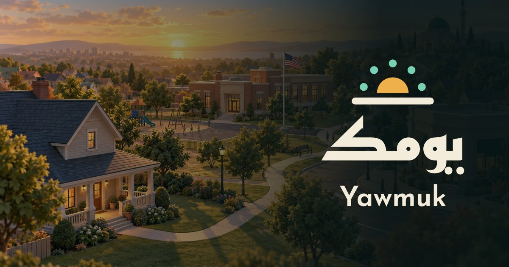
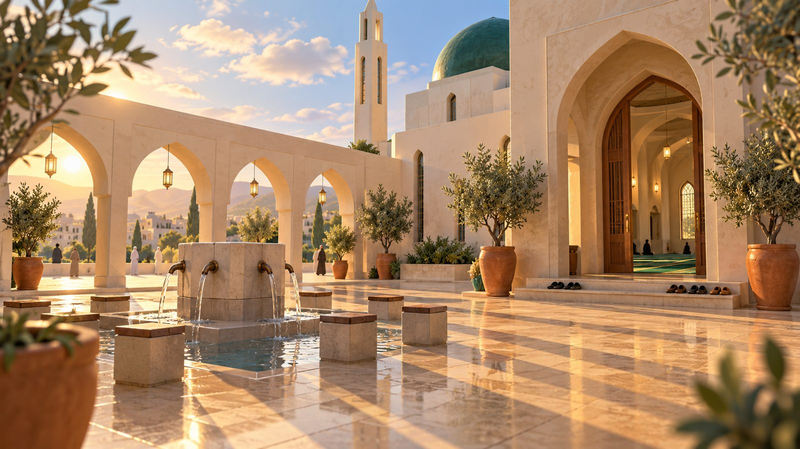
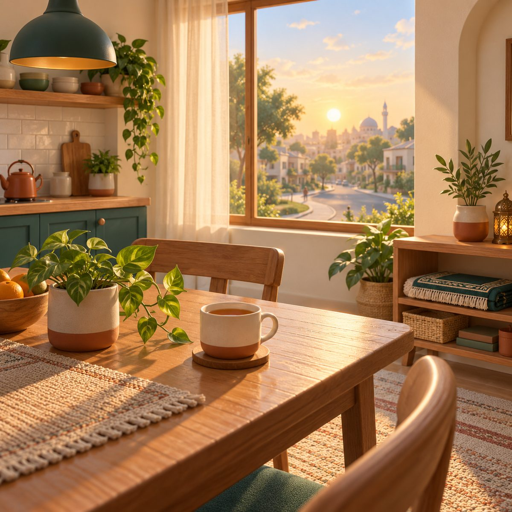

# دليل هوية «يومك» · Yawmuk Brand Book

**قوس اليوم: يومٌ كامل من الحياة اليومية، بين شروق وغروب، تنتظمه خمس صلوات — The Day Arc: one ordinary day, sunrise to nightfall, held together by five prayers.**

> «يومك» هي الأخت الصغرى لهوية «مدار»، وتشترك معها في بنية دليل الهوية نفسها: رموز التصميم في ملف واحد، وأدوار دلالية لكل ثيم، وتباين مفحوص آلياً، وشعار مرسوم بالكود. وتختلف عنها في الشخصية: مدار ليلٌ ونجوم وملاحة مهنية، ويومك نهارٌ وبيت وحيّ ومسجد.
>
> *Yawmuk is Madar's younger sibling. It shares Madar's brand-book architecture: one token file, semantic roles per theme, automatically tested contrast, and a logo drawn in code. Its personality differs: Madar is night, stars and career navigation; Yawmuk is daylight, home, neighbourhood and mosque.*

| المصدر الوحيد للحقيقة · Single source of truth | الملف · File |
| --- | --- |
| الرموز (ألوان، خطوط، أشكال، حركة، إضاءة المشاهد) · Tokens (colour, type, shape, motion, scene light) | `src/brand/tokens.json` (W3C DTCG) |
| متغيرات CSS المولّدة · Generated CSS variables | `src/brand/tokens.css`، عبر `node src/brand/build.mjs` |
| مولّد الشعارات · Logo generator | `src/brand/make-logos.mjs`، ويُخرج `public/brand/logo/*.svg` و`public/favicon.svg` |
| مسارات الشعار الكتابي · Wordmark outlines | `src/brand/wordmark-paths.json` |
| الاختبارات · Tests | `tests/brand.test.mjs`: التزامن، وتباين WCAG، وسلامة ملفات SVG، والوسوم الوصفية |

## 1. القصة والمعنى · Story & meaning

«يومك» كلمة قريبة: «يومك»، أي يومك أنت. ليست درساً ولا محاضرة، بل يوم عادي لآدم: يخرج من البيت، ويمرّ بالمدرسة والبنك والسوق، ويدخل المسجد، ويسأل. وفي كل محطة موقف حقيقي، وجواب موثّق من مصدر معتمد.

> «Yawmuk» means *your day*. Not a lesson or a lecture, but one ordinary day for Adam: he leaves home, passes the school, the bank and the shops, steps into the mosque, and asks. Every stop is a real situation, and every answer cites an approved source.

الفكرة البصرية «قوس اليوم»: خط أفق، وعليه نصف شمس تشرق، وفوقها خمس نقاط على قوس السماء. النقاط هي مواقيت الصلوات الخمس، فالمسلم يقيس يومه بها. وتُقرأ النقاط من الشرق: الفجر أولاً على يمين الشعار، ثم الظهر في القمة، ثم العصر والمغرب والعشاء.

> The visual idea is the *Day Arc*: a horizon line, a half sun rising on it, and five points on the sky arc above. The points are the five prayer times, the measure by which a Muslim's day is kept. They read from the east: fajr first on the mark's right, dhuhr at the zenith, then asr, maghrib and isha.

### القيم · Values

- **الدقّة قبل الجاذبية:** لا جملة دينية بلا مصدر، ولا صورة توحي بما لم يثبت. — *Accuracy before appeal: no religious sentence without a source, no image that implies what is not established.*
- **الدفء:** ضيافة البيت، لا رهبة المؤسسة. — *Warmth: the welcome of a home, not the formality of an institution.*
- **الوضوح:** مستويان من اللغة (عربي وإنجليزي)، وجملة قصيرة، وخطوة واحدة في كل شاشة. — *Clarity: two languages, short sentences, one step per screen.*
- **الاحترام:** نعرض الإسلام كما يعيشه الناس، بلا وعظ مُثقل ولا تبسيط مخلّ. — *Respect: Islam as people live it, without heavy preaching or careless simplification.*

## 2. نبرة الكتابة · Voice & tone

نتكلم كجار عارف ولطيف: نُرحّب، ونشرح، ونحيل إلى المصدر، ونعترف بحدودنا. نستخدم «نحن» للفريق و«أنت» للاعب، ولا نستخدم صيغة الأمر في الأحكام.

> We speak like a knowledgeable, kind neighbour: we welcome, explain, cite and admit our limits. "We" is the team, "you" is the player, and rulings are never phrased as orders from us.

| الموقف · Situation | ✓ نقول · We say | ✗ لا نقول · We don't say |
| --- | --- | --- |
| ترحيب · Welcome | «صباح الخير! يومك يبدأ من البيت.» — *"Good morning! Your day starts at home."* | «أيها المستخدم، ابدأ التعلم الآن!» — *"User, start learning now!"* |
| جواب موثّق · Sourced answer | «هذا ما تذكره المصادر المعتمدة، وهذا رابط المصدر.» — *"Here is what the approved sources say, with the link."* | «الحكم القطعي هو…» دون مصدر — *"The definitive ruling is…" with no source* |
| مسألة خلافية · Disputed issue | «للعلماء في هذه المسألة أقوال، وهذه أشهرها مع نسبتها.» — *"Scholars hold several views; here are the main ones, attributed."* | «الصحيح بلا شك…» — *"Without doubt the correct view is…"* |
| سؤال شخصي · Personal fatwa | «سؤالك يحتاج مفتياً يعرف تفاصيل حالتك؛ أرسلناه إلى لوحة المراجعين.» — *"Your question needs a mufti who knows your details; we've sent it to the reviewers."* | «في حالتك يجوز لك…» — *"In your case you may…"* |
| خطأ تقني · Error | «تعذّر الاتصال. جرّب مرة أخرى، أو تابع اللعب دون اتصال.» — *"Couldn't connect. Try again, or keep playing offline."* | «حدث خطأ غير معروف (500).» — *"Unknown error (500)."* |

- الأرقام العربية الغربية (0–9) في الواجهتين، وأرقام جدولية للأوقات. — *Western digits (0–9) in both languages, tabular figures for times.*
- لا تعجّب متكرر، ولا رموز تعبيرية في المحتوى الديني. — *No exclamation chains, no emoji in religious content.*
- كل نص يولّده الذكاء الاصطناعي يحمل إشارة «مولَّد بالذكاء الاصطناعي من مصادر مراجَعة». — *Every AI-generated text carries an "AI-generated from reviewed sources" label.*

## 3. الشعار وبناؤه · Logo & construction

**الرمز (قوس اليوم)** مرسوم على شبكة 100 وحدة:

- خط الأفق: من (12، 72) إلى (88، 72)، سماكته 7 وحدات، بأطراف مستديرة.
- نصف الشمس: دائرة نصف قطرها 16 ومركزها (50، 64)، والجزء العلوي فقط. بين قاعدتها وخط الأفق فراغ 4.5 وحدات، فتبدو الشمس طالعة لا ملتصقة.
- نقاط الصلوات: خمس دوائر نصف قطرها 4 على قوس نصف قطره 30 حول مركز الشمس، عند الزوايا 12° و51° و90° و129° و168° من الأفق الشرقي. المسافات بينها متساوية (39°)، وهي ترمز إلى الصلوات ولا تمثّل أوقاتها الفلكية.

> **The symbol (Day Arc)** sits on a 100-unit grid: a horizon from (12, 72) to (88, 72), 7 units thick with round caps; a half sun of radius 16 centred at (50, 64), with a 4.5-unit gap above the horizon so it reads as *rising*; and five prayer points of radius 4 on a radius-30 arc at 12°, 51°, 90°, 129° and 168° from the east horizon. The spacing is an even 39°: the points are symbolic, not astronomical.

**الشعار الكتابي:** «يومك» بخط Reem Kufi (وزن 700)، و«Yawmuk» بخط Reem Kufi (وزن 600). شُكّلت الحروف بمحرّك HarfBuzz ثم حُوّلت إلى مسارات بمكتبة fontTools، فلا يعتمد الشعار على تحميل أي خط. رخصة Reem Kufi هي OFL-1.1 وتسمح بهذا الاستخدام. الكلمة تجلس على خط الأفق نفسه: خط القاعدة للكلمة هو خط الأفق في الرمز. يُنصح بأن يراجع خطاط عربي الشعار الكتابي قبل تسجيله علامة تجارية.

> **Wordmark:** «يومك» in Reem Kufi 700 and «Yawmuk» in Reem Kufi 600, shaped with HarfBuzz and converted to outlines with fontTools, so the logo needs no font download. Reem Kufi is OFL-1.1, which permits this. The word sits *on the horizon*: its baseline is the symbol's horizon line. Have an Arabic lettering artist review the wordmark before filing it as a trademark.

| التشكيلة · Lockup | الاستخدام · Use | الملفات · Files |
| --- | --- | --- |
| أفقي عربي · Horizontal AR | الافتراضي في الواجهة العربية؛ الرمز يمين الكلمة · Default in Arabic; symbol to the right | `public/brand/logo/yawmuk-ar-{light,dark,mono}.svg` |
| أفقي إنجليزي · Horizontal EN | الواجهة الإنجليزية؛ الرمز يسار الكلمة · English UI; symbol to the left | `yawmuk-en-{light,dark,mono}.svg` |
| عمودي ثنائي · Stacked bilingual | الشاشة الافتتاحية، الصورة الاجتماعية، العرض التقديمي · Splash, social card, deck | `yawmuk-stacked-{light,dark,mono}.svg` |
| الرمز وحده · Symbol | مؤشر التحميل، الأيقونات، الصور الرمزية · Loader, icons, avatars | `yawmuk-mark-{light,dark,mono}.svg` |
| أيقونة التطبيق · App icon | الشاشة الرئيسية للجوال · Home screen | `yawmuk-app-icon.svg` و`-180/-192/-512.png` |
| أيقونة المتصفح · Favicon | 16–32px: شمس وأفق وثلاث نقاط فقط · Sun, horizon and three points only | `public/favicon.svg` |

ألوان الرمز: الشمس كهرماني `sun-400`، والأفق والكلمة بلون `ink-900` على الفاتح و`sand-100` على الداكن، والنقاط زيتوني `olive-700` على الفاتح و`olive-300` على الداكن. النسخة الأحادية تستخدم `currentColor`.

> Symbol colours: the sun is `sun-400` amber; the horizon and word are `ink-900` on light and `sand-100` on dark; the points are `olive-700` on light and `olive-300` on dark. The mono version uses `currentColor`.

## 4. المساحة الآمنة والحد الأدنى للحجم · Clearspace & minimum size

وحدة المساحة الآمنة (س) = ارتفاع نصف الشمس (16 وحدة على الشبكة). اترك «س» على الأقل من كل جهة؛ لا يدخلها نص ولا حافة ولا صورة مزدحمة.

> Clearspace unit (x) = the height of the half sun (16 grid units). Keep at least x free on every side: no text, edge or busy image inside it.

| العنصر · Element | أدنى حجم على الشاشة · Min. on screen | أدنى حجم في الطباعة · Min. in print |
| --- | --- | --- |
| الرمز · Symbol | 24px عرضاً · 24px wide | 8 mm |
| أيقونة المتصفح · Favicon variant | 16px | — |
| الأفقي · Horizontal lockup | 24px ارتفاعاً · 24px tall | 8 mm |
| العمودي · Stacked lockup | 64px ارتفاعاً · 64px tall | 20 mm |

تحت 24px استخدم نسخة favicon، فالنقاط الخمس تتلاشى في الأحجام الصغيرة. — *Below 24px use the favicon variant: five points blur at tiny sizes.*

## 5. الاستخدام الخاطئ · Misuse

- ✗ لا تضف هلالاً أو نجمة أو قبة إلى الرمز؛ النقاط الخمس هي الإشارة الدينية الوحيدة فيه. — *Don't add a crescent, star or dome; the five points are its only religious reference.*
- ✗ لا تغيّر عدد النقاط ولا ترتيبها، ولا تجعلها ساعة أو مواقيت حقيقية. — *Don't change the number or order of points, or turn them into a clock or real prayer times.*
- ✗ لا تُعِد كتابة «يومك» بخط آخر، ولا تمدّها بالكشيدة، ولا تباعد بين حروفها. — *Don't retype «يومك» in another font, stretch it with kashida or letter-space it.*
- ✗ لا تقلب الرمز في الواجهة الإنجليزية؛ الشعارات لا تنعكس مع الاتجاه. — *Don't mirror the symbol in LTR; logos never mirror.*
- ✗ لا تضع الشعار فوق صورة مزدحمة دون طبقة تعتيم بلون `ink-950` لا تقل عن 55٪. — *Don't place the logo on a busy image without an `ink-950` scrim of at least 55%.*
- ✗ لا تستخدم الكهرماني في الكلمة، ولا تضف ظلالاً أو تدرجات أو حداً خارجياً. — *Don't colour the word amber or add shadows, gradients or outlines.*
- ✗ لا تضع الشعار بجوار نص قرآني أو داخل إطار المصحف. — *Never place the logo next to Quran text or inside a mushaf frame.*

## 6. نظام الألوان «يوم كامل» · Colour system «A whole day»

الواجهة داكنة افتراضياً لأنها زجاج فوق مشهد ثلاثي الأبعاد حيّ: حبر أزرق مخضرّ عميق، ونص بلون الورق الرملي، وكهرماني الشمس للإجراء الأساسي، وزيتوني للتسميات، وطيني للتحذير. والثيم الفاتح (ورق لا أبيض) للوثائق ولوحة المراجعين والمطبوعات، ويُفعَّل بـ `data-yk-theme="light"` على أي حاوية.

> The UI is dark by default because it is glass over a live 3D scene: deep teal ink, sand-paper text, sun amber for the main action, olive for labels, terracotta for warnings. The light theme (paper, not white) is for documents, the reviewers' console and print; switch any container with `data-yk-theme="light"`.

| اللون · Colour | HEX | الدور · Role |
| --- | --- | --- |
| حبر الليل · Ink 900 | `#0A1D1F` | خلفية اللعبة والنص على الفاتح · Game background, text on light |
| شمس · Sun 400 | `#EDB04A` | الزر الأساسي، الشمس، الإبراز · Primary button, the sun, highlights |
| زيتون · Olive 500 | `#2F8F74` | الأشجار والفناء والتسميات · Trees, courtyard, labels |
| رمل · Sand 100 | `#F4ECDB` | النص على الداكن، الورق · Text on dark, paper |
| طين · Clay 400 | `#E8846B` | الدفء والسقوف والتحذير · Warmth, roofs, warnings |
| غسق · Dusk 300 | `#A9C9EC` | المعلومات والسماء · Info, sky |

**الأدوار الدلالية والتباين** (أدنى نسبة للدور على الأسطح الأربعة: bg وsurface وraised وsunken، محسوبة آلياً في `tests/brand.test.mjs`):

> **Semantic roles and contrast** (the weakest ratio of each role across the four surfaces, computed by `tests/brand.test.mjs`):

| الدور · Role | فاتح · Light | تباين · Ratio | داكن · Dark | تباين · Ratio | الاستخدام · Use |
| --- | --- | --- | --- | --- | --- |
| text | `#0A1D1F` | 13.88 | `#F4ECDB` | 11.49 | النص الأساسي · Body text |
| textSoft | `#2E4442` | 8.30 | `#DCCDB0` | 8.62 | الفقرات الثانوية · Secondary paragraphs |
| muted | `#4F5F5B` | 5.38 | `#B9C7C1` | 7.72 | التسميات والتلميحات · Labels, hints |
| accent | `#1C6352` | 5.68 | `#EDB04A` | 7.02 | الإجراء والروابط والعناوين الفرعية · Action, links, sub-heads |
| accentHi | `#134A3D` | 8.09 | `#F6CF7E` | 9.10 | التحويم والنقاط في الواجهة · Hover, HUD score |
| teal | `#1C6352` | 5.68 | `#78D1B0` | 7.43 | التسميات العلوية والتقدّم · Eyebrows, progress |
| info | `#2C5A85` | 5.77 | `#A9C9EC` | 7.88 | معلومة · Info |
| ok | `#1B6E40` | 5.01 | `#62D08E` | 7.03 | نجاح · Success |
| warn | `#7D4E06` | 5.66 | `#F6CF7E` | 9.10 | تنبيه · Warning |
| danger | `#A63F26` | 4.99 | `#F2A68E` | 6.83 | خطأ · Error |
| lineStrong | `#8C7F66` | 3.14 | `#6A8984` | 3.55 | حدود الحقول (غير نصي، ≥3) · Input borders (non-text, ≥3) |
| focus | `#1C6352` | 5.68 | `#F6CF7E` | 9.10 | حلقة التركيز 3px · 3px focus ring |
| onAccent / accent | `#FFFFFF` على `#1C6352` | 7.10 | `#1E1404` على `#EDB04A` | 9.43 | نص الزر الأساسي · Primary-button text |

شارات الأحكام تحتفظ بألوانها المضبوطة سابقاً، وكلها AA مع نص أبيض (أدناها «حلال» 5.35)، وشارة «خلافية» بنص داكن (9.89). وأُضيفت إلى الرموز باسم `--yk-verdict-*`.

> Ruling badges keep their tuned fills, all AA with white text (lowest: halal at 5.35); "disputed" uses dark text (9.89). They are now tokens: `--yk-verdict-*`.

**✓ افعل · Do**

- استخدم متغيرات `--yk-*` فقط داخل أي ميزة جديدة، ولا تكتب HEX مباشرة. — *Use `--yk-*` variables only in new features; never hard-code HEX.*
- نص الزر الكهرماني دائماً `onAccent` الداكن. — *Text on the amber button is always the dark `onAccent`.*
- في الثيم الفاتح يصبح الزيتوني العميق هو لون الإجراء. — *On light, deep olive becomes the action colour.*

**✗ لا تفعل · Don't**

- لا تكتب نصاً بالكهرماني `#EDB04A` على الورق الفاتح: تباينه نحو 1.9:1، فهو للرسوم فقط. — *Never set amber `#EDB04A` text on light paper: ≈1.9:1, graphics only.*
- لا تستخدم الأحمر الصريح للتحذير؛ الطيني يكفي ويبقى دافئاً. — *Don't use pure red for warnings; terracotta is enough and stays warm.*
- لا تُدخل ألواناً من خارج الرموز إلى المشاهد أو الواجهة. — *Don't bring off-token colours into scenes or UI.*

### إضاءة المشاهد حسب الصلاة · Scene light by prayer time

الهوية تمتد إلى العالم ثلاثي الأبعاد: لكل وقت صلاة لوحة إضاءة (سماء، أفق، شمس، إضاءة محيطة) في `tokens.json → scene` وفي CSS باسم `--yk-scene-<وقت>-<طبقة>`. يربطها مالك المحرك بمواقيت الصلاة الحية، فيتغيّر ضوء الحيّ مع اليوم.

> The identity extends into the 3D world: each prayer time has a light set (sky, horizon, sun, ambient) in `tokens.json → scene` and as CSS `--yk-scene-<time>-<layer>`. The engine owner can drive them from live prayer times so the neighbourhood's light follows the day.

| الوقت · Time | السماء · Sky | الأفق · Horizon | الشمس · Sun | المحيط · Ambient |
| --- | --- | --- | --- | --- |
| الفجر · Fajr | `#2B3D66` | `#E9A27C` | `#FFD9A8` | `#5A6A8E` |
| الضحى · Duha | `#9CCBEB` | `#F4E6C8` | `#FFF1CF` | `#CFE0E6` |
| الظهر · Dhuhr | `#7FB8E6` | `#E8F1F4` | `#FFFFFF` | `#E4ECEA` |
| العصر · Asr | `#8DB9DA` | `#F6D9A0` | `#FFE3A3` | `#E9D8B6` |
| المغرب · Maghrib | `#4F4C7E` | `#EE8E5E` | `#FFB27A` | `#9C7B86` |
| العشاء · Isha | `#0B1A33` | `#1F3557` | `#C9D6F0` | `#2A3A55` |

## 7. الخطوط · Typography

أربع عائلات، ولكل منها وظيفة واحدة، وكلها من Google Fonts برخصة OFL:

> Four families, one job each, all from Google Fonts under OFL:

| الرمز · Token | الخط · Family | الاستخدام · Use |
| --- | --- | --- |
| `--yk-font-display` | Reem Kufi 500–700 | لحظات العرض فقط: اسم اللعبة، أسماء المحطات، شاشة النهاية · Display moments only: title, stop names, end screen |
| `--yk-font-ui` | IBM Plex Sans Arabic 400–700 | الواجهة والنصوص والعناوين العربية (بوزن 700) · UI, body and Arabic headings (700) |
| `--yk-font-quran` | Amiri Quran، ثم Amiri، ثم Noto Naskh Arabic | النص القرآني فقط، لأن Amiri Quran مصمم لعلامات الرسم العثماني · Quran text only: Amiri Quran is built for Uthmani marks |
| `--yk-font-hadith` | Amiri، ثم Noto Naskh Arabic | نصوص الحديث والأذكار المنقولة · Quoted hadith and adhkar |

| المستوى · Level | الحجم · Size | السطر · Line height |
| --- | --- | --- |
| hero | clamp(2.6rem, 6vw, 3.6rem) | 1.15 |
| h1 | clamp(1.6rem, 3.4vw, 2.2rem) | 1.3 |
| h2 | 1.4rem | 1.45 |
| h3 | 1.04rem | 1.45 |
| body | 1rem | 1.9 للعربية، و1.6 للإنجليزية · 1.9 Arabic / 1.6 English |
| small | 0.88rem | 1.6 |
| caption | 0.8rem | 1.5 |

- لا تباعد بين الحروف العربية أبداً (القاعدة مفروضة في CSS بـ `:lang(ar)`)، والتتبّع للتسميات اللاتينية الكبيرة فقط. — *Never letter-space Arabic (enforced in CSS via `:lang(ar)`); tracking is for Latin caps labels only.*
- النص القرآني لا يُكتب بخط الواجهة، ولا يُصغّر عن 1.25rem، ولا يُقطع بالحذف. — *Quran text is never set in the UI face, never below 1.25rem, never truncated with an ellipsis.*
- لا نص مائل، ولا تلوين كلمة واحدة في عنوان. — *No italics, no single recoloured word in a headline.*

## 8. الأيقونات · Iconography

- شبكة 24px، وخط أحادي 1.75px بأطراف مستديرة، وهو منطق خط الأفق في الرمز نفسه. — *24px grid, 1.75px monoline, round caps: the horizon line's logic.*
- مفرّغة افتراضياً، وتُملأ في الحالة النشطة فقط. — *Outline by default; filled only when active.*
- الأيقونات الاتجاهية تنعكس في العربية، والساعة والشعار وأيقونة القبلة لا تنعكس. — *Directional icons mirror in RTL; the clock, logo and qibla icon never do.*
- الأيقونات الزخرفية تحمل `aria-hidden="true"`، والأيقونة الوحيدة في زر تحتاج `aria-label`. — *Decorative icons get `aria-hidden`; an icon-only button needs `aria-label`.*
- لا نرسم لفظ الجلالة ولا آيات داخل أيقونة. — *Never draw the Name of God or verses inside an icon.*

## 9. الرسوم والمشاهد ثلاثية الأبعاد · Illustration & 3D scenes

الأسلوب «ديوراما منزلية دافئة»: أشكال بسيطة منخفضة المضلعات بحواف مستديرة، وخامات مطفأة كالطين، وضوء شمس دافئ بظلال طويلة ناعمة. ليس كرتونياً ولا واقعياً تماماً.

> Style: *warm home diorama*. Simple low-poly shapes with rounded bevels, matte clay-like materials, warm sunlight with long soft shadows. Neither cartoonish nor photoreal.

| | |
| --- | --- |
|  |  |

- **الضوء:** شمس واحدة ومصدرها واضح، واللون من جدول «إضاءة المشاهد». — *Light: one sun with a clear direction, coloured from the scene-light table.*
- **العمارة:** حيّ أمريكي معاصر، ومسجد حيّ متواضع بقبة بسيطة ومئذنة نحيلة، بلا زخرفة مفرطة. — *Architecture: a contemporary American neighbourhood and a modest local mosque, simple dome and slim minaret, no ornamental excess.*
- **الناس:** ملابس محتشمة ومتنوعة، وملامح بسيطة؛ ولا تصوير للأنبياء أو الصحابة بأي شكل. — *People: modest, diverse clothing, simple features; never any depiction of prophets or Companions.*
- **الكتابة في المشهد:** ممنوعة. لا لافتات بنص مولّد، ولا خط عربي زخرفي، ولا آيات على الجدران. النص القرآني يظهر في الواجهة فقط، مأخوذاً من مصدر معتمد. — *Text in scenes is forbidden: no generated signage, no decorative calligraphy, no verses on walls. Quran text appears only in the UI, fetched from an approved source.*
- **الرموز:** نتجنّب الإفراط في الهلال والفوانيس والنجوم؛ الهوية تقول «يوم» لا «رمضان». — *Avoid crescent, lantern and star overload: the brand says "day", not "Ramadan".*
- **الصور المولّدة:** تُصرَّح بها دائماً. المصدر والتعليمات في `public/brand/provenance.json`، ونراجع كل صورة يدوياً للتأكد من خلوها من الكتابة والوجوه الواضحة والرموز المبتذلة. — *Generated images are always disclosed. Provenance and prompts are in `public/brand/provenance.json`; each is hand-checked for text, identifiable faces and clichés.*

## 10. مكوّنات الواجهة · UI Components

| المكوّن · Component | القاعدة · Rule |
| --- | --- |
| الزر الأساسي `.btn.primary` · Primary | كبسولة كهرمانية بنص `onAccent`، وحافة سفلية تنضغط عند الضغط. إجراء أساسي واحد في الشاشة · Amber pill, `onAccent` text, a slab edge that compresses on press. One per screen |
| الزر العادي `.btn` · Default | كبسولة حبرية بحد `line-strong` · Ink pill with a `line-strong` border |
| الزر الشفاف `.btn.ghost` · Ghost | للإلغاء والأدوات الصغيرة · Cancel and small tools |
| زر الخطر `.btn.danger` · Danger | حد طيني وخلفية شفافة · Terracotta outline, no fill |
| النافذة `.modal` واللوحة `.sheet` · Modal & sheet | زجاج `ink-700→ink-900` باستدارة `radius-panel` (22px)، وحافة علوية مضيئة، وظل `depth-3` · Glass `ink-700→ink-900`, 22px radius, lit top edge, `depth-3` shadow |
| بطاقة الحكم · Ruling card | محتوى قابل للتمرير وتذييل ثابت لا يغطيه؛ شارة الحكم بلون `--yk-verdict-*` · Scrollable body, fixed footer that never covers content; verdict badge from `--yk-verdict-*` |
| شرائح الواجهة `.hud-chip` · HUD chips | كبسولات زجاجية فوق المشهد، والنقاط بلون `accentHi` · Glass pills over the scene; score in `accentHi` |
| لوحات الميزات الجديدة · New feature panels | الصنف `yk-<ميزة>-*`، واللون من `--yk-*` فقط، والنافذة RTL في العربية، وEsc يغلق، والتركيز محصور، وتعمل على عرض 390px · Prefix `yk-<feature>-*`, colours from `--yk-*` only, RTL in Arabic, Esc closes, focus trapped, works at 390px |

**الاستدارة · Radius:** `control` 12px للحقول، و`card` 14px للبطاقات، و`panel` 22px للنوافذ، و`pill` 999px للأزرار والشارات. — *12px inputs, 14px cards, 22px dialogs, 999px buttons and badges.*

**العمق · Depth:** `depth-1` للشرائح، و`depth-2` للبطاقات المرفوعة، و`depth-3` للنوافذ فقط. — *`depth-1` chips, `depth-2` lifted cards, `depth-3` dialogs only.*

## 11. الحركة · Motion

الحركة شمسية: تشرق العناصر وتستقر، ولا تقفز. المنحنى الافتراضي `ease-out` بقيمة cubic-bezier(0.2, 0.8, 0.2, 1)، والنوابض (`spring`) للأسطح الملموسة فقط كالأزرار والبطاقات والنوافذ.

> Motion is solar: elements rise and settle, they don't jump. Default easing `ease-out` is cubic-bezier(0.2, 0.8, 0.2, 1); `spring` is only for tactile surfaces (buttons, cards, dialogs).

| الرمز · Token | القيمة · Value | الاستخدام · Use |
| --- | --- | --- |
| `--yk-motion-fast` | 120ms | التحويم والضغط · Hover, press |
| `--yk-motion-base` | 220ms | انتقالات الواجهة · UI transitions |
| `--yk-motion-slow` | 450ms | النوافذ واللوحات · Dialogs, sheets |
| `--yk-motion-day-arc` | 2.4s | مؤشر التحميل: تضيء نقاط الصلوات بالترتيب من الفجر إلى العشاء · Loader: the prayer points light up in order, fajr to isha |

- انتقال المواقع: شمس صغيرة تشرق على خطها ثم تغيب، بدلاً من الدوران. — *Location changes: a small sun rises on its line and sets, instead of spinning.*
- مع «تقليل الحركة» تتوقف الحركة غير الضرورية، ولا يبقى أي محتوى مخفياً. — *With reduced motion, non-essential motion stops and no content stays hidden.*

## 12. الإتاحة · Accessibility

- كل أدوار النص AA (≥4.5:1)، والحدود وحلقة التركيز ≥3:1، في الثيمين، ومفحوصة آلياً. — *All text roles AA (≥4.5:1), borders and focus ≥3:1, both themes, tested automatically.*
- حلقة التركيز 3px بإزاحة 3px، ظاهرة دائماً عند التنقل بلوحة المفاتيح. — *3px focus ring, 3px offset, always visible for keyboard users.*
- أهداف اللمس 44px على الأقل، و52px للأزرار الكبيرة. — *Touch targets at least 44px; 52px for big buttons.*
- خصائص منطقية في CSS (inline-start/end)، فتنعكس الواجهة مع `dir="rtl"` تلقائياً. — *Logical CSS properties (inline-start/end), so the layout mirrors with `dir="rtl"` automatically.*
- `lang` صحيح على كل مقطع ثنائي اللغة، ليقرأه قارئ الشاشة بالصوت الصحيح. — *Correct `lang` on every bilingual fragment, so screen readers use the right voice.*
- اللون لا يحمل المعنى وحده: لكل شارة حكم أيقونة ونص. — *Colour never carries meaning alone: each verdict badge has an icon and a label.*

## 13. افعل ولا تفعل · Do & don't

| ✓ افعل · Do | ✗ لا تفعل · Don't |
| --- | --- |
| ابدأ كل ميزة من `--yk-*` · Start every feature from `--yk-*` | لا تنسخ قيم HEX من ملف آخر · Don't copy HEX from another file |
| اجعل الكهرماني للإجراء الأساسي الوحيد · Keep amber for the one main action | لا تجعل كل زر كهرمانياً · Don't make every button amber |
| ضع النص القرآني بخط Amiri Quran ومصدره ورقمه · Set Quran text in Amiri Quran with its source and number | لا تضع آية في صورة أو زخرفة أو خلفية · Never put a verse in an image, ornament or background |
| صرّح بالصور المولّدة · Disclose generated images | لا تقدّم صورة مولّدة على أنها صورة حقيقية · Never present a generated image as a photograph |
| استخدم شمس الأفق ونقاط اليوم رمزاً · Use the horizon sun and day points as the motif | لا تُغرق الواجهة بالأهلّة والفوانيس · Don't flood the UI with crescents and lanterns |

## 14. الملفات · Assets

| الملف · File | الوصف · Description |
| --- | --- |
| `src/brand/tokens.json` | الرموز بصيغة W3C DTCG · Tokens (W3C DTCG) |
| `src/brand/tokens.css` | متغيرات `--yk-*` المولّدة، ويستوردها `src/styles/main.css` في أول سطر · Generated `--yk-*` variables, imported first by `main.css` |
| `src/brand/build.mjs` | يولّد CSS ويحسب تباين WCAG · Builds the CSS, computes WCAG contrast |
| `src/brand/make-logos.mjs` | يرسم كل ملفات الشعار من الكود · Draws every logo file from code |
| `public/brand/logo/` | 12 ملف SVG للشعار، وأيقونة التطبيق SVG وPNG بثلاثة مقاسات · 12 logo SVGs, app icon SVG + 3 PNG sizes |
| `public/favicon.svg` | أيقونة المتصفح · Favicon |
| `public/brand/og-image.jpg` / `.svg` | صورة المشاركة الاجتماعية 1200×630 · Social card 1200×630 |
| `public/brand/imagery/` | ثلاث صور رئيسية مولّدة ومصرّح بها · Three disclosed generated key-art images |
| `public/brand/provenance.json` | مصدر كل صورة وتعليماتها · Generator and prompt for each image |

**التحقق · Verify:** `node --test tests/brand.test.mjs`، ثم `node src/brand/build.mjs && node src/brand/make-logos.mjs && git diff --stat`. يجب ألا يتغير شيء إذا كانت الملفات متزامنة. — *Run the brand tests, then regenerate and check that `git diff` is empty.*

